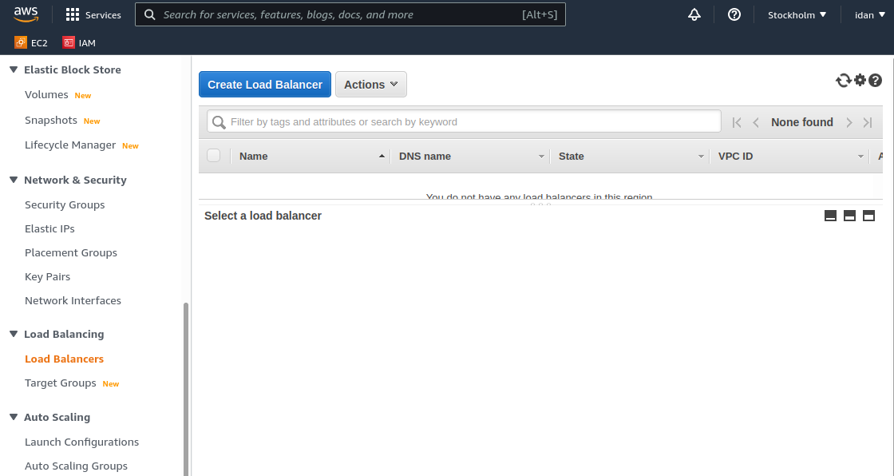

## 1. Create, run and configure instances on AWS as for single server configuration
 -- with application (Ubuntu)
 -- with database
## 2. Configure ddclient service with no-ip DDNS for database server
 In my case i configured database server ddns name dbgeo.ddns.net
## 3. Create AWS Load balancer

Add DNS name of created Load balancer to deploy script as address of app server and DDNS name of daatabase server

Deploy Application to App Server

Partial test of application an database

Create Image of Instance

Create Launch Template from Instance

Create Auto Scaling Group

And now we see new instance creating

Stop original instance (source for template)

And now we can connect to instance via load balances DNS.

