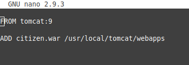
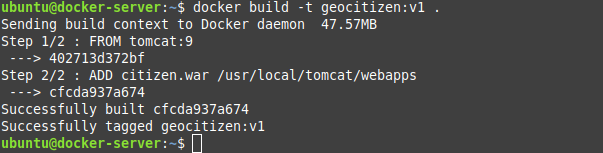
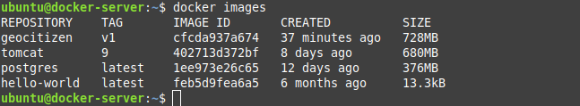
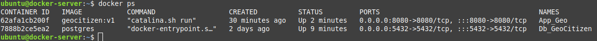
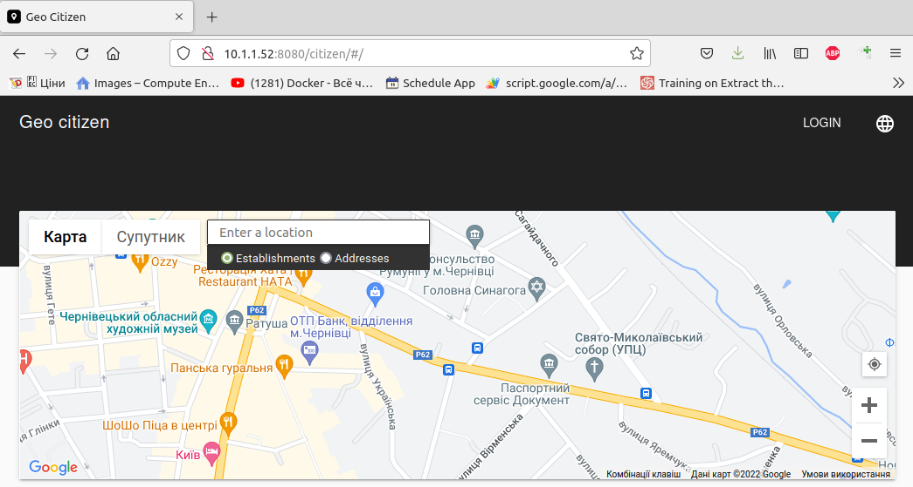

### 1. Create Application image 
We can also create image with app inside. 

Create sipmle Dockerfile 

and run

`$ docker build -t geocitizen:v1 .`

Created image:

### 2. Create Docker Containers

Database container

`$ docker run -d --name Db_GeoCitizen -e POSTGRES_DB=Geo -e POSTGRES_USER=Geo -e POSTGRES_PASSWORD=GeoCitizenDocker postgres`

Application container

`$ docker run -d --name App_Geo -p 8080:8080 geocitizen:v1`

### 3. Check application

