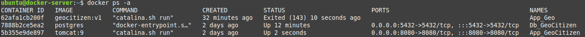
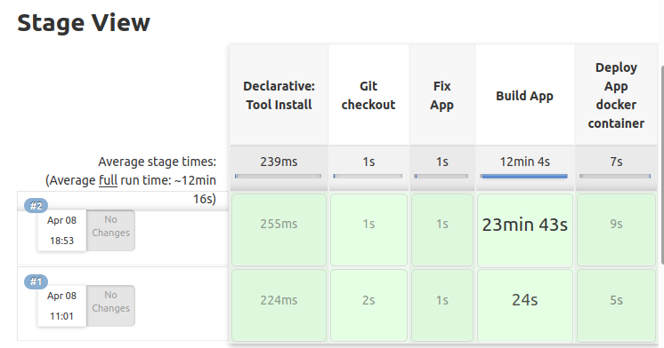

### 1. Create Docker Containers

`$ docker run -d --name App_GeoCitizen -p 8080:8080 tomcat:9`

`$ docker run -d --name Db_GeoCitizen -e POSTGRES_DB=Geo -e POSTGRES_USER=Geo -e POSTGRES_PASSWORD=GeoCitizenDocker postgres`

### 2. Create Jenkins Pipeline

pipeline{

    agent any
    tools {
     maven 'Maven'
     git 'Default'
    }
    stages {
        stage ('Git checkout'){
            steps {
                git branch: 'main', url: 'https://github.com/idanylyuk/Geocit134.git'
            }
        }    
        stage('Fix App'){
            steps{
                sh "cp /home/ubuntu/docker/config/hosts_geo '${WORKSPACE}'"
                sh "cp /home/ubuntu/docker/app/deploy '${WORKSPACE}'"
                sh './deploy'
            }
        }
        stage('Build App') {
            steps {
                sh 'mvn -version'
                sh 'mvn clean install'
            }
        }
        stage('Deploy App docker container') {
            steps{
                sshagent(['docker_ssh']) {
                    sh "scp -o StrictHostKeyChecking=no target/citizen.war ubuntu@10.1.1.52:~"
                    sh "ssh -o StrictHostKeyChecking=no ubuntu@10.1.1.52 'docker cp citizen.war App_GeoCitizen:/usr/local/tomcat/webapps'"
                }
            }
        }         
    }   
}    

### 3. Stop and remove Docker containers
`$ docker stop App_GeoCitizen`

`$ docker rm App_GeoCitizen`

`$ docker stop Db_GeoCitizen`

`$ docker rm Db_GeoCitizen`

