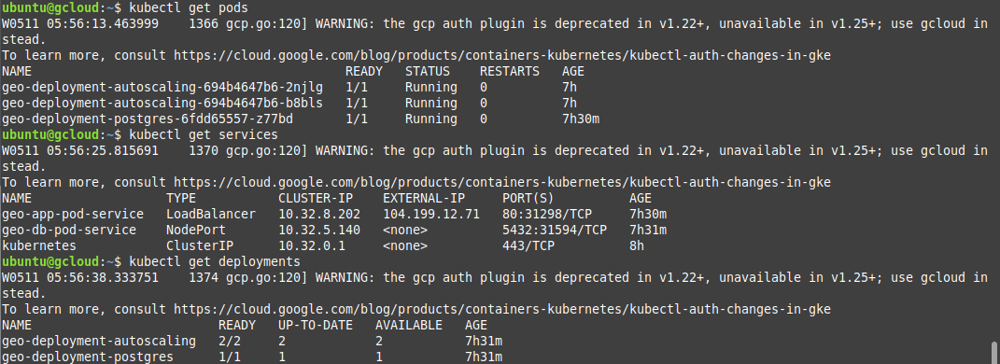
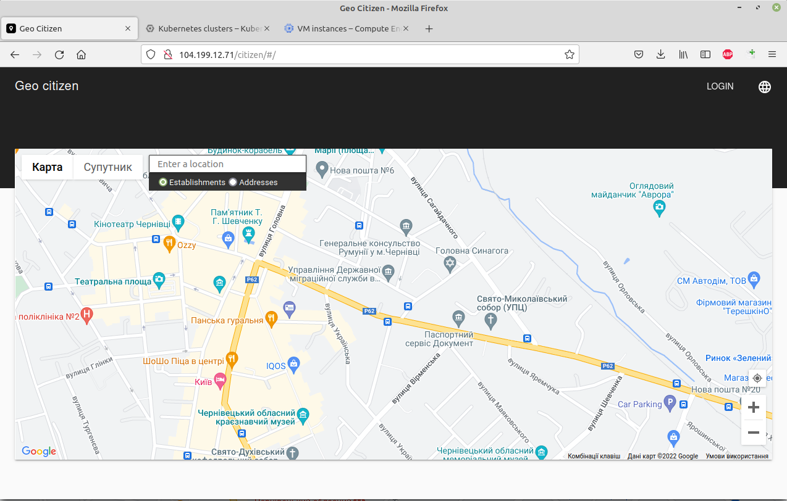

## Install the gcloud CLI

` https://cloud.google.com/sdk/docs/install#deb`

` sudo apt-get install apt-transport-https ca-certificates gnupg`

` echo "deb [signed-by=/usr/share/keyrings/cloud.google.gpg] https://packages.cloud.google.com/apt cloud-sdk main" | sudo tee -a /etc/apt/sources.list.d/google-cloud-sdk.list`

` curl https://packages.cloud.google.com/apt/doc/apt-key.gpg | sudo apt-key --keyring /usr/share/keyrings/cloud.google.gpg add -`

` sudo apt-get update && sudo apt-get install google-cloud-cli`

## Install kubectl and configure cluster access

### Gcloud init

Run gcloud init and follow the directions:

` gcloud init`

If you are using SSH on a remote server, use the --console-only flag to prevent the command from launching a browser:

` gcloud init --console-only`

Follow the instructions to authorize the gcloud CLI to use your Google Cloud account.
Create a new configuration or select an existing one.

Choose a Google Cloud project.

Choose a default Compute Engine zone/region.

**!!! Do not set zone. Only region later by command**

` gcloud config set compute/region ....`

### Install kubectl

` sudo apt-get install kubectl`

Verify that kubectl is installed:

` kubectl version`

### Install required plugins

kubectl and other Kubernetes clients require an authentication plugin, gke- gcloud-auth-plugin

` sudo apt-get install google-cloud-sdk-gke-gcloud-auth-plugin`

` gcloud container clusters get-credentials CLUSTER_NAME`


## Deploy geocitizen application

1.Build application war-file with fake adresses and push it to docker hub.

```
$ docker login -u <user>
$ docker push xbuyer/data:geo_minikube
```

2.Generate in docker hub access token

3.Create secret with kubectl

```
$ kubectl create secret docker-registry geosecret --docker-server='https://index.docker.io/v1/' --docker-username='-----' --docker-password='--------------' --docker-email='--------'
```

4.Create Infrastructure

`$ kubectl apply -f db.yml`

`$ kubectl apply -f app.yml`

5.Get Ip-adresses



6.Rebuild application war-file with real adresses and push it to docker hub with new tag.

```
$ docker login -u <user>
$ docker push xbuyer/data:geo_minikube_v2
```

8.Update image for App Load Balancer Pods

```
$ kubectl set image deployment/geo-deployment-autoscaling app-web=docker.io/xbuyer/data:geo_minikube_v2
```
9.Use application



### Manifest files

db.yml file

```
apiVersion : apps/v1
kind: Deployment
metadata:
  name: geo-deployment-postgres
  labels:    
    project : geocitizen
spec:
  selector:
    matchLabels:
      project: geocitizen-db
  template:
    metadata:
      labels:
        project: geocitizen-db  # Service will look for those PODS Labels!!!
    spec:
      containers:
        - name : app-db
          env:
          - name: POSTGRES_DB
            value: Geo
          - name: POSTGRES_USER
            value: Geo  
          - name: POSTGRES_PASSWORD
            value: GeoCitizenDocker
          image: postgres
          ports:
            - containerPort: 5432
              
---
apiVersion: v1
kind: Service
metadata:
  name: geo-db-pod-service
  labels:
     env  : test
     owner: uixcoder
spec:
  selector:
    project:  geocitizen-db      # Selecting PODs with those Labels
  ports:
    - name      : db-listener
      protocol  : TCP
      port      : 5432  # Port on Load Balancer
      targetPort: 5432  # Port on Pod
  type: NodePort           

```

app.yml file


```
apiVersion : apps/v1
kind: Deployment
metadata:
  name: geo-deployment-autoscaling
  labels:    
    project : geocitizen
spec:
  selector:
    matchLabels:
      project: geocitizen-app
  template:
    metadata:
      labels:
        project: geocitizen-app  # Service will look for those PODS Labels!!!
    spec:
      containers:
      - name : app-web
        image: docker.io/xbuyer/data:geo_minikube_v2
        imagePullPolicy: Always
        ports:
        - containerPort: 8080  
      imagePullSecrets:
      - name: geosecret

---
apiVersion: autoscaling/v1
kind: HorizontalPodAutoscaler
metadata:
  name: geo-autoscaler
spec:
  scaleTargetRef:
    apiVersion: apps/v1
    kind: Deployment
    name: geo-deployment-autoscaling
  minReplicas: 2
  maxReplicas: 6
  targetCPUUtilizationPercentage: 50


---
apiVersion: v1
kind: Service
metadata:
  name: geo-app-pod-service
  labels:
     env  : test
     owner: uixcoder
spec:
  selector:
    project:  geocitizen-app      # Selecting PODs with those Labels
  ports:
    - name      : app-listener
      protocol  : TCP
      port      : 80  # Port on Load Balancer
      targetPort: 8080  # Port on Pod
  type: LoadBalancer

```

### Jenkins pipeline file
pipeline{

    agent any
    tools {
     maven 'Maven'
     git 'Default'
    }
    stages {
        stage ('Git checkout'){
            steps {
                git branch: 'main', url: 'https://github.com/idanylyuk/Geocit134.git'
            }
        }    
        stage('Fix App'){
            steps{
                sh "cp /home/ubuntu/kubernetes/hosts_geo '${WORKSPACE}'"
                sh "cp /home/ubuntu/kubernetes/deploy '${WORKSPACE}'"
                sh '${WORKSPACE}/deploy'
            }
        }
        stage('Build App') {
            steps {
                sh 'mvn -version'
                sh 'mvn clean install'
                sh "cp '${WORKSPACE}'/target/citizen.war /home/ubuntu/kubernetes/ "
                
                
            }
        }
        stage('Build Docker image') {
            steps{
                  sh "docker build -t xbuyer/data:geo_minikube /home/ubuntu/kubernetes/"
                  //sh "docker push xbuyer/data:geo_minikube"
            }
        }         
    }   
}    


