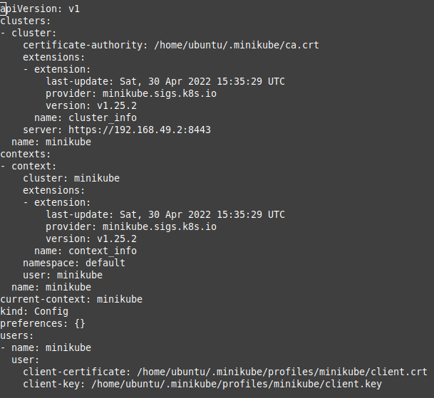

## Kubernetes - K8s

[Official site](https://kubernetes.io)

Written on Go, 2014+

Is used for containerized applications...

Automatization for applications

    - Deployment
    - Scaling
    - Controlling

**Components**

***Cluster*** (consists of Nodes)
  
***Nodes***

    - Master Node
    - Worker Node

## 1. Install minikube

### 1.1. Install kubectl

[Info](https://kubernetes.io/docs/tasks/tools/install-kubectl-linux/)

1.Update the apt package index and install packages needed to use the Kubernetes apt repository:

```
$ sudo apt-get update
$ sudo apt-get install -y apt-transport-https ca-certificates curl
```

2.Download the Google Cloud public signing key:

```
$ sudo curl -fsSLo /usr/share/keyrings/kubernetes-archive-keyring.gpg https://packages.cloud.google.com/apt/doc/apt-key.gpg
```

3.Add the Kubernetes apt repository:

```
$ echo "deb [signed-by=/usr/share/keyrings/kubernetes-archive-keyring.gpg] https://apt.kubernetes.io/ kubernetes-xenial main" | sudo tee /etc/apt/sources.list.d/kubernetes.list
```

4.Update apt package index with the new repository and install kubectl:

```
$ sudo apt-get update
$ sudo apt-get install -y kubectl
```

### 1.2. Verify kubectl configuration

Test to ensure the version you installed is up-to-date:

`$ kubectl version --client`

Or use this for detailed view of version:

`$ kubectl version --client --output=yaml`

Check that kubectl is properly configured by getting the cluster state:

`$ kubectl cluster-info`

If you see a URL response, kubectl is correctly configured to access your cluster.

If you see a message similar to the following, kubectl is not configured correctly or is not able to connect to a Kubernetes cluster.

`The connection to the server <server-name:port> was refused - did you specify the right host or port?`

For example, if you are intending to run a Kubernetes cluster on your laptop (locally), you will need a tool like Minikube to be installed first and then re-run the commands stated above.

### 1.3. Install minikube

https://minikube.sigs.k8s.io/docs/start/

minikube is local Kubernetes, focusing on making it easy to learn and develop for Kubernetes.

All you need is Docker (or similarly compatible) container or a Virtual Machine environment, and Kubernetes is a single command away: minikube start

What you’ll need

    2 CPUs or more
    2GB of free memory
    20GB of free disk space
    Internet connection
    Container or virtual machine manager, such as: Docker, Hyperkit, Hyper-V, KVM, Parallels, Podman, VirtualBox, or VMware Fusion/Workstation

To install the latest minikube stable release on x86-64 Linux using binary download:

```
$ curl -LO https://storage.googleapis.com/minikube/releases/latest/minikube-linux-amd64
$ sudo install minikube-linux-amd64 /usr/local/bin/minikube
```
### 1.4. Use minikube

From a terminal with administrator access (but not logged in as root), run:

`$ minikube start`


If minikube fails to start, see the drivers page for help setting up a compatible container or virtual-machine manager.

Configuration of minicube is at file .kube/config



All minikube files are stored in directory .minikube


`$ kubectl get componentstatuses`


`$ kubectl cluster-info`


`$ kubectl get nodes`


Stop minikube


Delete minikube (iso images are not deleted)


Start minikube with addittional parameters


Login


`$ minikube addons list`


```
$ minikube dashboard
$ kubectl proxy --address='0.0.0.0' --disable-filter=true
```
Open in browser

`$ http://10.1.1.60:8001/api/v1/namespaces/kubernetes-dashboard/services/http:kubernetes-dashboard:/proxy/`


### 2.1. Working with pods

Starts new pod with name app-geo, docker image tomcat:9 and port 8080:

`$ kubectl run app-geo --image=tomcat:9 --port=8080`

Get pods info

`$ kubectl get pods`

`$ kubectl describe pods app-geo`

Delete pod

`$ kubectl delete pods app-geo`

Login to created pod (app-geo)

`$ kubectl exec -it app-geo bash`


View log files of pod

`$ kubectl logs app-geo`

Port forwarding

`$ kubectl port-forward app-geo 8081:8080`

### 2.2. Manifest file for pod

```
pod-app-geo-v1.yaml
-------------------
apiVersion : v1
kind: Pod
metadata:
  name: app-geo
spec:
  containers:
    - name  : container-tomcat
      image : tomcat:9
      ports :
        - containerPort : 80
-------------------
```

Create pod

`$ kubectl apply -f pod-app-geo-v1.yaml`

Delete pod

`$ kubectl delete -f pod-app-geo-v1.yaml`

When node is terminated - all pods also terminates!!!

### 2.3. Deployments

`$ kubectl create deployment test --image tomcat:9`

`$ kubectl get deploy`

`$ kubectl get deployments`

Manual scaling

```
$ kubectl scale deployment test --replicas 2
$ kubectl get deploy
$ kubectl get pods
```

Also creates 'replica set'

`$ kubectl get rs`

Auto scaling

`$ kubectl autoscale deployment test --min=2 --max=4 --cpu-percent=80`

Creates 'horizontal pod autoscaler'

`$kubectl get hpa`


`$ kubectl rollout status deployment/test`

`$ kubectl set image deployment/test tomcat=tomcat:8.5`


Undo previous deployment

`$ kubectl rollout undo deployment/test `

`$ kubectl rollout undo deployment/test  --to-revision=2`

Restart deployment (for latest image)

`$ kubectl rollout restart deployment/test`

### 2.4. Deoployments manifest file

```
deployment-geo.yml 
------------------
apiVersion: apps/v1
kind: Deployment
metadata:
  name: geocitizen-deployment
  labels:
    app : Geo
    env : test
spec:
  selector:
    matchLabels:
      project: geocitizen
  replicas: 1
  template:
    metadata:
      labels:
        project: geocitizen
    spec:
      containers:
      - name: geo-app
        image: tomcat:9
        ports:
        - containerPort: 8080
------------------
```

`$ kubectl apply -f deployment-geo.yml`


```

------------------------
apiVersion: apps/v1
kind: Deployment
metadata:
  name: geo-auto
  labels:
    app : Geo
    env : test
spec:
  selector:
    matchLabels:
      project: geoauto
  replicas: 1
  template:
    metadata:
      labels:
        project: geoauto
    spec:
      containers:
      - name: geo-app
        image: tomcat:9
        ports:
        - containerPort: 8080
```
Autoscaling

```
 deploy-geo-autoscaling.ym
---
apiVersion: autoscaling/v2
kind: HorizontalPodAutoscaler
metadata:
  name: geo-scaler
spec:
  scaleTargetRef:
    apiVersion: apps/v1
    kind: Deployment
    name: geo-auto
  minReplicas: 2
  maxReplicas: 4
  metrics:
  - type: Resource
    resource:
      name: cpu
      target:
        type: Utilization
        averageUtilization: 70
  - type: Resource
    resource:
      name: memory
      target:
        type: Utilization
        averageUtilization: 80

------------------------
```

### 2.5. Geocitizen

1.Build application war-file with fake adresses and push it to docker hub.

```
$ docker login -u <user>
$ docker push xbuyer/data:geo_minikube
```

2.Generate in docker hub access token

3.Create secret with kubectl

```
$ kubectl create secret docker-registry geosecret --docker-server='https://index.docker.io/v1/' --docker-username='-----' --docker-password='--------------' --docker-email='--------'
```

4.Create Infrastructure

`$ kubectl apply -f db.yml`

`$ kubectl apply -f app.yml`

5.Get Ip-adresses


6.Run minikube tunnel

`$ minikube tunnel`

7.Rebuild application war-file with real adresses and push it to docker hub with new tag.

```
$ docker login -u <user>
$ docker push xbuyer/data:geo_minikube_v2
```

8.Update image for App Load Balancer Pods

```
$ kubectl set image deployment/geo-deployment-autoscaling app-web=docker.io/xbuyer/data:geo_minikube_v2
```
9.Use application


10.Dashboard with created infrastrubture


### Manifest files

db.yml file

```
apiVersion : apps/v1
kind: Deployment
metadata:
  name: geo-deployment-postgres
  labels:    
    project : geocitizen
spec:
  selector:
    matchLabels:
      project: geocitizen-db
  template:
    metadata:
      labels:
        project: geocitizen-db  # Service will look for those PODS Labels!!!
    spec:
      containers:
        - name : app-db
          env:
          - name: POSTGRES_DB
            value: Geo
          - name: POSTGRES_USER
            value: Geo  
          - name: POSTGRES_PASSWORD
            value: GeoCitizenDocker
          image: postgres
          ports:
            - containerPort: 5432
              
---
apiVersion: v1
kind: Service
metadata:
  name: geo-db-pod-service
  labels:
     env  : test
     owner: uixcoder
spec:
  selector:
    project:  geocitizen-db      # Selecting PODs with those Labels
  ports:
    - name      : db-listener
      protocol  : TCP
      port      : 5432  # Port on Load Balancer
      targetPort: 5432  # Port on Pod
  type: NodePort           

```

app.yml file


```
apiVersion : apps/v1
kind: Deployment
metadata:
  name: geo-deployment-autoscaling
  labels:    
    project : geocitizen
spec:
  selector:
    matchLabels:
      project: geocitizen-app
  template:
    metadata:
      labels:
        project: geocitizen-app  # Service will look for those PODS Labels!!!
    spec:
      containers:
      - name : app-web
        image: docker.io/xbuyer/data:geo_minikube_v2
        imagePullPolicy: Always
        ports:
        - containerPort: 8080  
      imagePullSecrets:
      - name: geosecret

---
apiVersion: autoscaling/v2
kind: HorizontalPodAutoscaler
metadata:
  name: geo-autoscaler
spec:
  scaleTargetRef:
    apiVersion: apps/v1
    kind: Deployment
    name: geo-deployment-autoscaling
  minReplicas: 2
  maxReplicas: 6
  metrics:
    - type: Resource
      resource:
        name: cpu
        target:
          type: Utilization
          averageUtilization: 50
    - type: Resource
      resource:
        name: memory
        target:
          type: Utilization
          averageUtilization: 50

---
apiVersion: v1
kind: Service
metadata:
  name: geo-app-pod-service
  labels:
     env  : test
     owner: uixcoder
spec:
  selector:
    project:  geocitizen-app      # Selecting PODs with those Labels
  ports:
    - name      : app-listener
      protocol  : TCP
      port      : 80  # Port on Load Balancer
      targetPort: 8080  # Port on Pod
  type: LoadBalancer

```

### Jenkins pipeline file
pipeline{

    agent any
    tools {
     maven 'Maven'
     git 'Default'
    }
    stages {
        stage ('Git checkout'){
            steps {
                git branch: 'main', url: 'https://github.com/idanylyuk/Geocit134.git'
            }
        }    
        stage('Fix App'){
            steps{
                sh "cp /home/ubuntu/kubernetes/hosts_geo '${WORKSPACE}'"
                sh "cp /home/ubuntu/kubernetes/deploy '${WORKSPACE}'"
                sh '${WORKSPACE}/deploy'
            }
        }
        stage('Build App') {
            steps {
                sh 'mvn -version'
                sh 'mvn clean install'
                sh "cp '${WORKSPACE}'/target/citizen.war /home/ubuntu/kubernetes/ "
                
                
            }
        }
        stage('Build Docker image') {
            steps{
                  sh "docker build -t xbuyer/data:geo_minikube /home/ubuntu/kubernetes/"
                  //sh "docker push xbuyer/data:geo_minikube"
            }
        }         
    }   
}    


