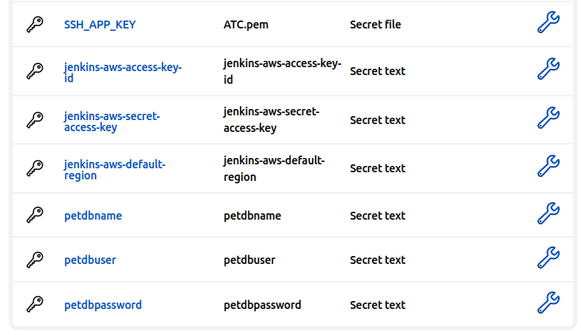

## Jenkins Deploy petclinic application pipeline

### 1. Infrastructure configuration storage

Manually create S3 Bucket **pet-clinic-project**


and DynamoDB lock table **petclinic-tf-lock**


with partition key **LockID**.


### 2. Manually add credentials to Jenkins for AWS access and future database access



### 3. Create and configure Pipeline that creates, configures infrastructure, deploys application

Create new pipeline Deploy2


Add [code](Jenkins2_1.txt) to pipeline

```
pipeline {
    agent {label 'agent1'}
    environment{
       AWS_ACCESS_KEY_ID=credentials('jenkins-aws-access-key-id')
       AWS_SECRET_ACCESS_KEY=credentials('jenkins-aws-secret-access-key')
       AWS_REGION=credentials('jenkins-aws-default-region')
       DB_NAME=credentials('petdbname')
       DB_USER=credentials('petdbuser')
       DB_PASSWORD=credentials('petdbpassword')       
    }

    tools {
        maven "M3"
    }

    stages {
        stage ('Get Project from repository'){
            steps {
                git branch: 'master', url: 'https://github.com/uixcoder/spring-framework-petclinic.git'
                dir ('Deploy') {
                    git branch: 'master', url: 'https://github.com/uixcoder/Deploy_AWS_EC2_RDS_MySQL.git'
                }
            }
        }
        stage ('Create AWS infrastructure'){
            steps {
              sh script: '''
                    chdir Deploy/Terraform
                    terraform init -reconfigure
                    terraform apply --auto-approve
              ''' 
            }
        }  
        stage ('Fix error / Preconfigure Project'){
           steps {
                sh "chmod u+x Deploy/Ansible/app/fix"
                sh "./Deploy/Ansible/app/fix"
                sh "find . -type f -name 'pom.xml' -exec sed -i 's/db1_name_template/$DB_NAME/g' {} +"
                sh "find . -type f -name 'pom.xml' -exec sed -i 's/db1_user_template/$DB_USER/g' {} +"
                sh "find . -type f -name 'pom.xml' -exec sed -i 's/db1_password_template/$DB_PASSWORD/g' {} +"
            }
        }        
        stage ('Config AWS infrastructure'){
            steps {
                sh "rm -f Deploy/config/ATC.pem"
                withCredentials([file(credentialsId: 'SSH_APP_KEY', variable: 'appsshkey')]) {
                    sh "cp \$appsshkey Deploy/config/"
                }   
                sh "ansible --version"
                sh script: '''
                    chdir Deploy/Ansible
                    ansible-playbook configAppServer.yml
                '''                 
                sh "rm -f Deploy/config/ATC.pem"
            }
        }    
        stage('Validate') {
            steps {
                sh "mvn validate"
            }
        }
        stage('Compile') {
            steps {
                sh "mvn compile"
            }
        }          
        //stage('Test Project') {
        //    steps {
        //        sh "mvn test"
        //    }
        //}          
        stage('Build') {
           steps {
                sh "mvn package -Dmaven.test.skip=true"
            }
        }
        stage('Deploy') {
            steps {
                sh "pwd"
                sh "[ ! -f target/petclinic.war ] || mv -f target/petclinic.war target/ROOT.war"
                sh "rm -f Deploy/config/ATC.pem"
                withCredentials([file(credentialsId: 'SSH_APP_KEY', variable: 'appsshkey')]) {
                    sh "cp \$appsshkey Deploy/config/"
                }   
                sh script: '''
                    chdir Deploy/Ansible
                    ansible-playbook deployApp.yml
                '''
                sh "rm -f Deploy/config/ATC.pem"                
            }
        }
    }
}
```

### 4. Build Application


### 5. Deployed App


### 6. Add GithHub Webhook for auto start build after git changes

Add WebHook for Repository Settings


Add Listener to Jenkins Pipeline


Build starts automatically after pushing to app repository https://github.com/uixcoder/spring-framework-petclinic and infrastructure repository https://github.com/uixcoder/Deploy_AWS_EC2_RDS_MySQL


