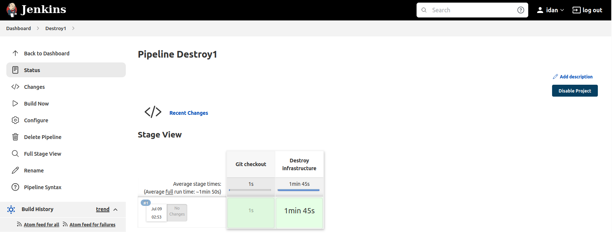

## Jenkins Destroy Deployment of petclinic application pipeline on AWS

### 1. Pipeline

Create new pipeline Destroy1

Add [code](Jenkins1_2.txt) to pipeline

```
pipeline {
    agent {label 'agent1'}
    environment{
       AWS_ACCESS_KEY_ID=credentials('jenkins-aws-access-key-id')
       AWS_SECRET_ACCESS_KEY=credentials('jenkins-aws-secret-access-key')
       AWS_REGION=credentials('jenkins-aws-default-region')
    }

    stages {
        stage ('Git checkout'){
            steps {
                dir ('Deploy') {
                    git branch: 'master', url: 'https://github.com/uixcoder/Deploy_AWS_EC2_PostgerSQL.git'
                }
            }
        }
        stage ('Destroy infrastructure'){
            steps {
              sh script: '''
                    chdir Deploy/Terraform
                    terraform init -reconfigure
                    terraform destroy --auto-approve
              ''' 
            }
        }  
    }
}

```

