## Install and Configure Jenkins

### 1. Create EC2 Instance

AWS_REGION = eu-north-1 (Stockholm)

12 GB Disk / 2GB RAM / t3.nano (free tier)

Credit specification - Standard

Ubuntu 18.04 LTS

**Problem:** 8GB disk created as in AMI.

**Solution:** Disk space may be increased later on demand by editing EBS Volumes. So i leave 8 GB size.

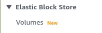

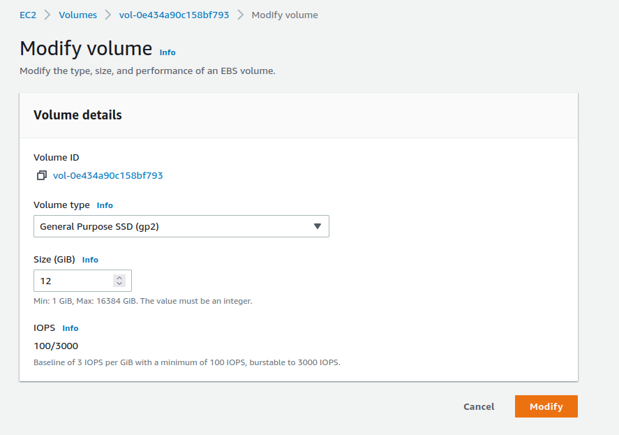

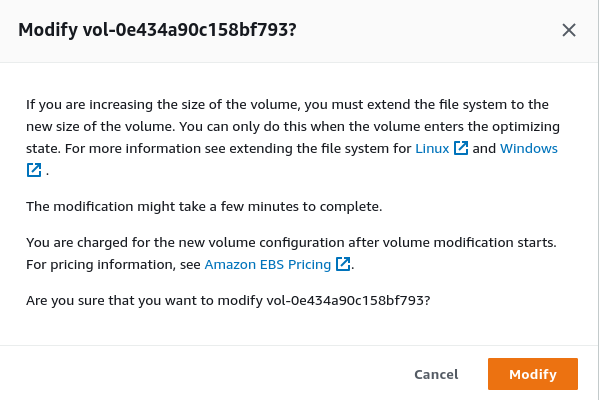

### 2. Install Docker

SSH to created EC2 instance via public IP

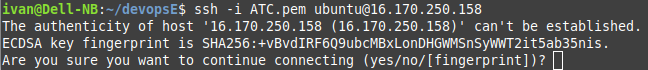


**Docker** - minimal version of VM

***Docker Components***

**Docker Engine**    - Docker App
**Docker Container** - running Docker VM
**Docker Image**     - image of Docker Container
**Docker file**      - for creating Docker images

***Docker workflow***

1. Docker Engine
2. Dockerfile
3. Build -> Docker Image
4. Run   -> Docker Container


Install

[https://docs.docker.com/get-docker/](https://docs.docker.com/get-docker/)

[https://docs.docker.com/engine/install/ubuntu/](https://docs.docker.com/engine/install/ubuntu/)

#### Set up the repository

1. Update the apt package index and install packages to allow apt to use a repository over HTTPS:

`$ sudo apt-get update`

`$ sudo apt-get remove docker docker-engine docker.io containerd runc`

2. Add Docker’s official GPG key:

`$ curl -fsSL https://download.docker.com/linux/ubuntu/gpg | sudo gpg --dearmor -o /usr/share/keyrings/docker-archive-keyring.gpg`

3. Use the following command to set up the stable repository. To add the nightly or test repository, add the word nightly or test (or both) after the word stable in the commands below. Learn about nightly and test channels.

`$ echo \
  "deb [arch=$(dpkg --print-architecture) signed-by=/usr/share/keyrings/docker-archive-keyring.gpg] https://download.docker.com/linux/ubuntu \
  $(lsb_release -cs) stable" | sudo tee /etc/apt/sources.list.d/docker.list > /dev/null`


#### Install Docker Engine

1. Update the apt package index, and install the latest version of Docker Engine and containerd, or go to the next step to install a specific version:

```
$ sudo apt-get update

$ sudo apt-get install docker-ce docker-ce-cli containerd.io
```

2. Verify that Docker Engine is installed correctly by running the hello-world image.


`$ sudo docker run hello-world`


This command downloads a test image and runs it in a container. When the container runs, it prints a message and exits.

Docker Engine is installed and running. The docker group is created but no users are added to it. You need to use sudo to run Docker commands. Continue to Linux postinstall to allow non-privileged users to run Docker commands and for other optional configuration steps.

#### Post-installation steps for Linux

`https://docs.docker.com/engine/install/linux-postinstall/`

`$ sudo groupadd docker`
`$ sudo usermod -aG docker $USER`

logout, login again

Verify that you can run docker commands without sudo.

`$ docker run hello-world`

Configure Docker to start on boot

`$ sudo systemctl enable docker.service`
`$ sudo systemctl enable containerd.service`

### 3. Start Jenkins container from image jenkins/jenkins:lts-jdk11

`$ docker run -d -v jenkins_home:/var/jenkins_home -p 80:8080 --restart=on-failure jenkins/jenkins:lts-jdk11`

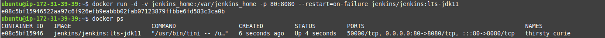

### 4. Login to Jenkins

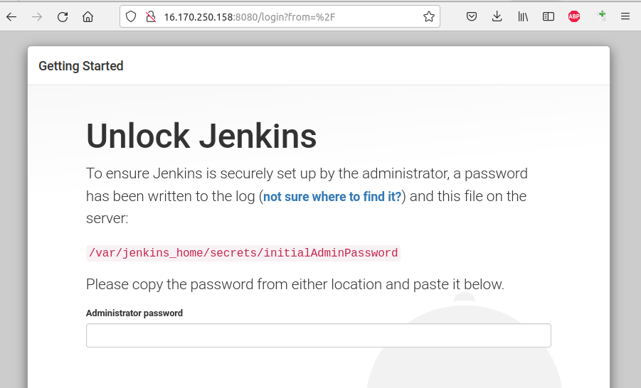

To view file login to container

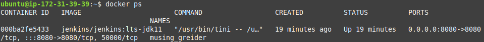
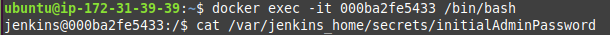

or view attached volume content

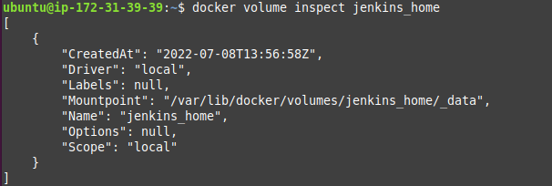


Install plugins

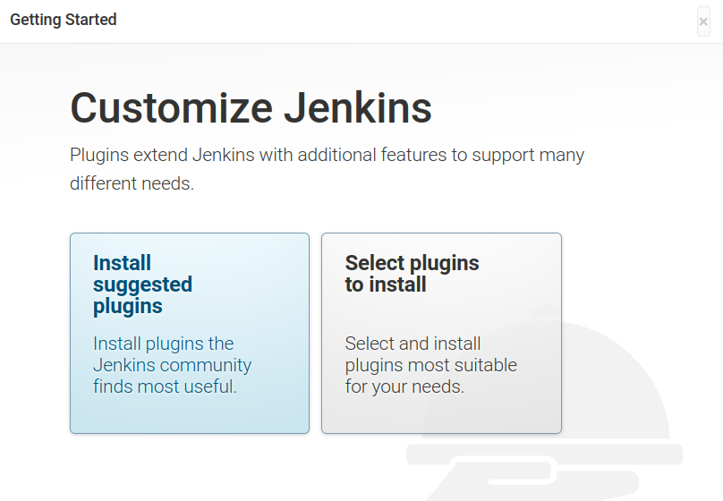

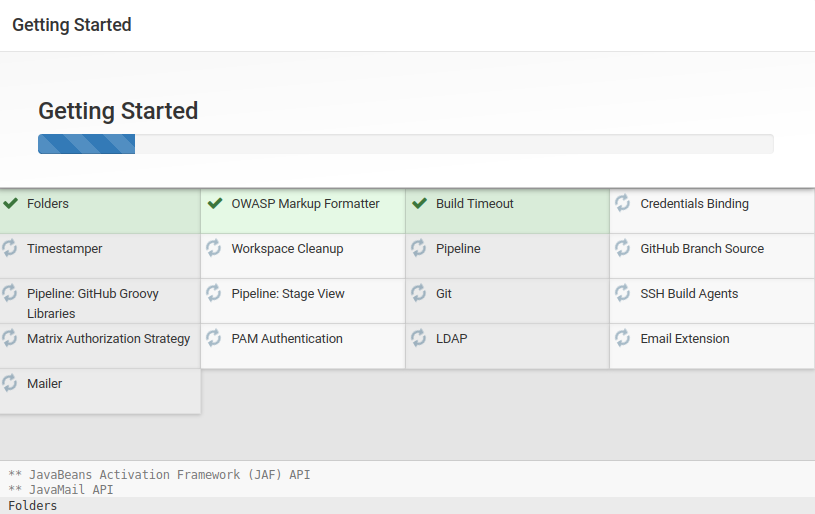

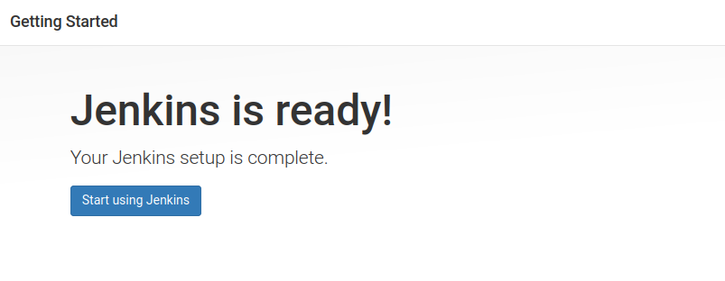

Login.

Fresh install of Jenkins is not secure

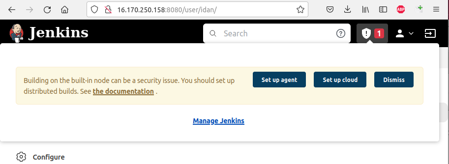

It requires removing build executors from Jenkins node and add agents with build executors.

### 5. Generate Docker image for AGENTS

Jenkins agent image allows using SSH to establish the connection. It can be used together with the SSH Build Agents plugin or other similar plugins.

[Dockerfile](Dockerfile)

```
FROM jenkins/ssh-agent:jdk11
#Install Terraform
RUN apt-get update
RUN apt-get install -y apt-utils curl unzip
RUN curl -fSSL https://releases.hashicorp.com/terraform/1.2.4/terraform_1.2.4_linux_amd64.zip -o terraform.zip \
    && unzip terraform.zip \
    && mv terraform /usr/local/bin/terraform \
    && rm terraform.zip
#Install ansible
RUN apt-get install -y python3 python3-pip
RUN pip3 install ansible
```
Build image

`$ docker build -t jenkinsagent .`

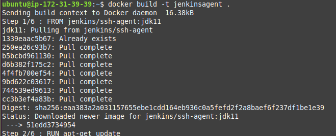

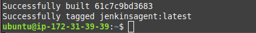

Run agent container on 23 port

`$ docker run -p 23:22 -d --name agent1 --init --restart=on-failure -v agent1-workdir:/home/jenkins jenkinsagent "<public key>"`

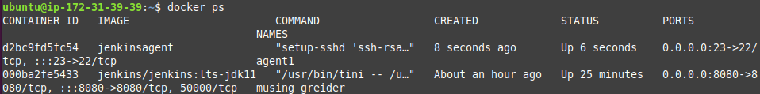

Add new node 

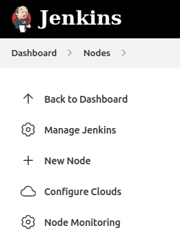

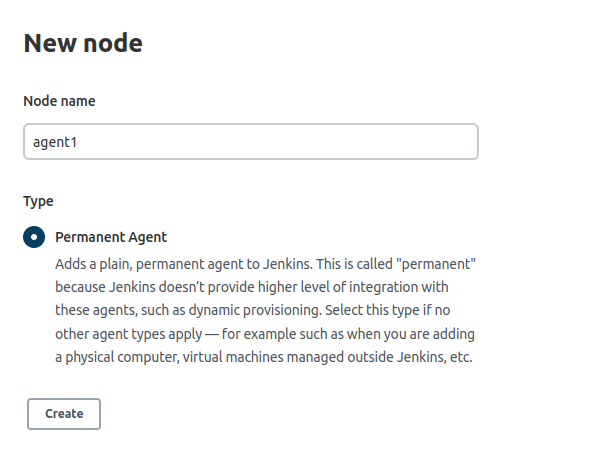

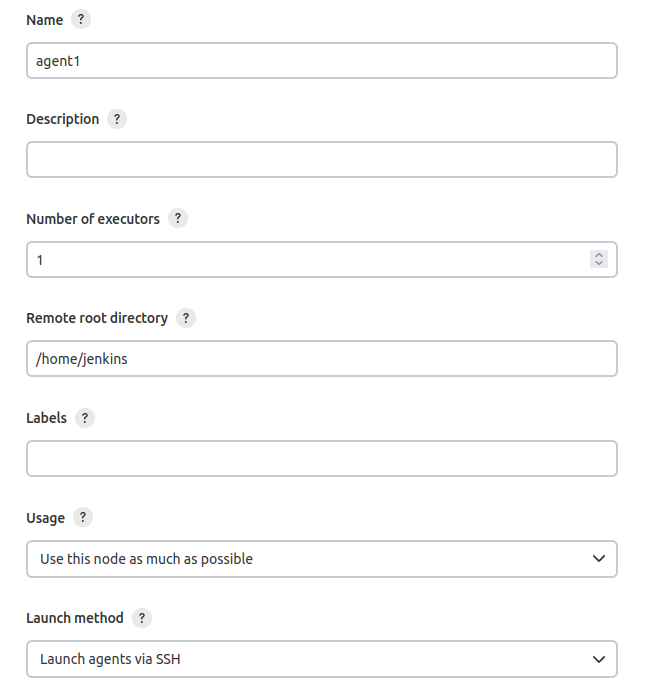

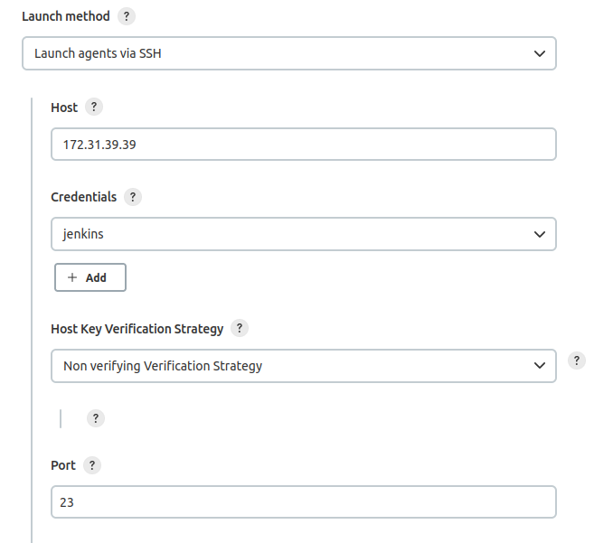

Successfully connected to agent ...

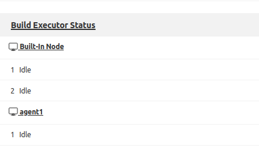

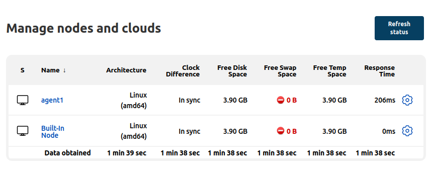

Now remove 2 executors from built-in node

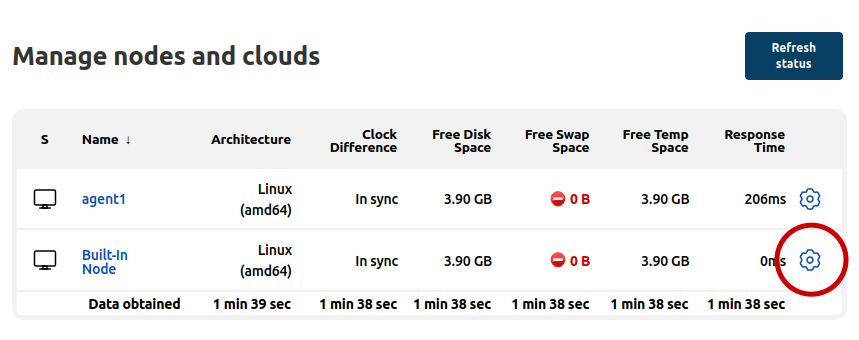

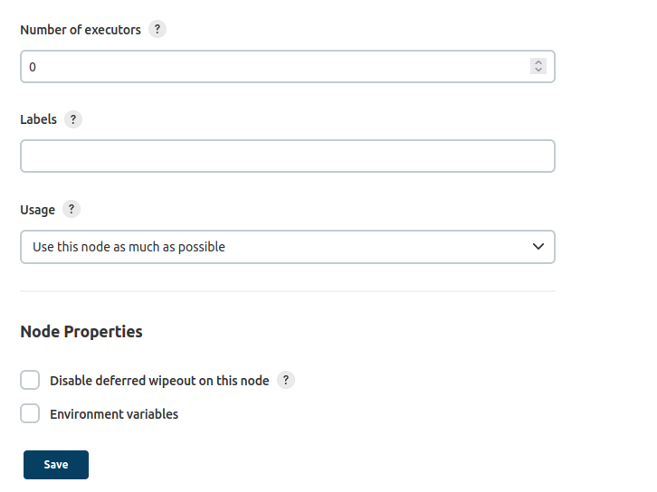

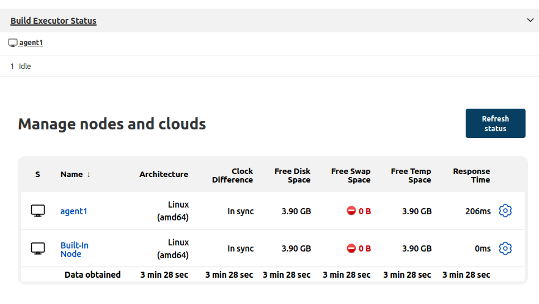

### 6. Add 1G swap area on Docker EC2 Instance

Add swapfile

```
$ sudo dd if=/dev/zero of=/swapfile bs=1M count=1024
$ sudo chmod 0600 /swapfile
$ sudo mkswap /swapfile
$ sudo swapon /swapfile
```
To activate /swapfile1 after Linux system reboot, add entry to /etc/fstab file. Open this file using a text editor such as nano:

`$ sudo nano /etc/fstab`

Append the following line:

`/swapfile none swap sw 0 0`

Result

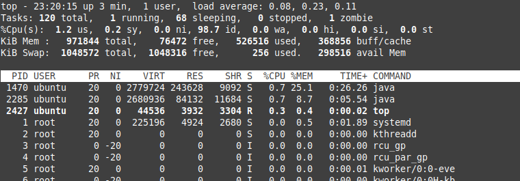

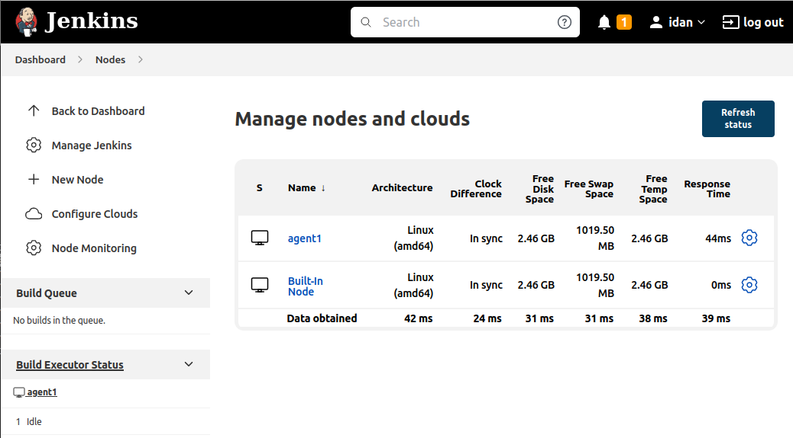

### 7. Add permanent DNS Name to Jenkins node

All Steps are described [here](UpdateZoneForEC2.md).

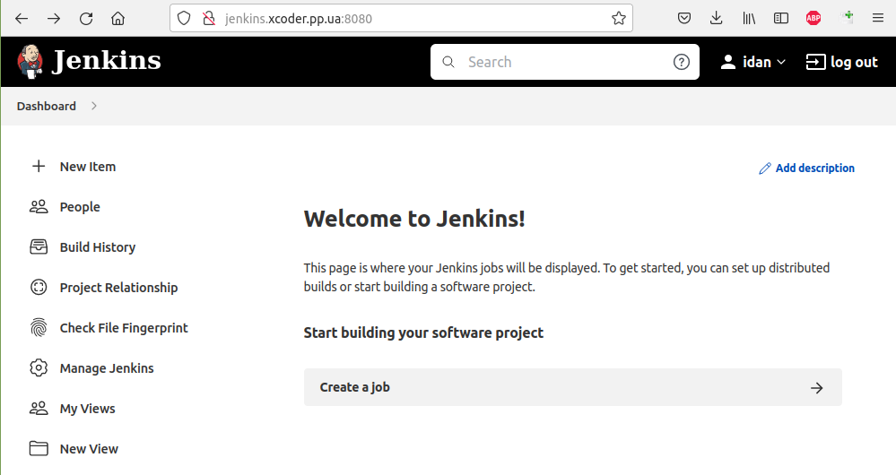

#### 8. Close all unneeded ports, leave open only 22 and 80 port.

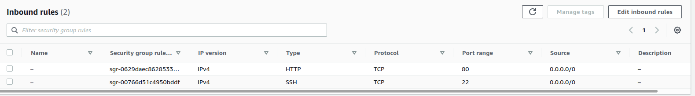

### 9. Fix jenkins location on Jenkins settings

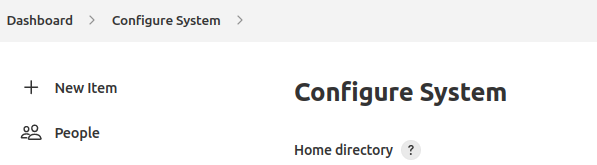
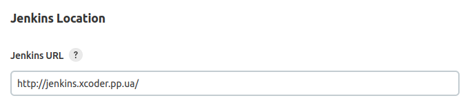

### 10. Run all containers after reboot

`$ docker update --restart unless-stopped $(docker ps -q)`

### 11. Add JGit and Maven auto istallation

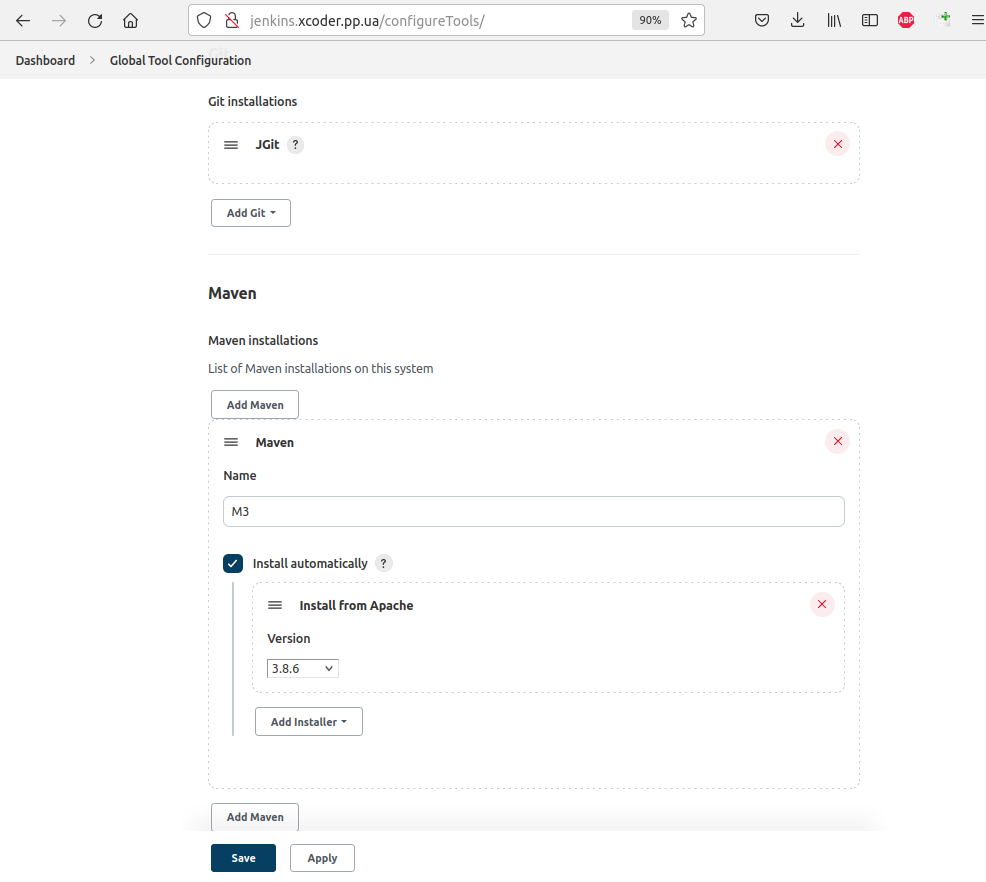

Jenkins are ready for PipeLines!!!

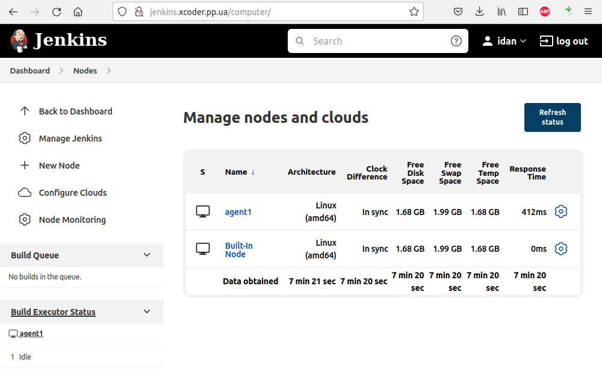

### 12. Create AMI Image of configured Jenkins


