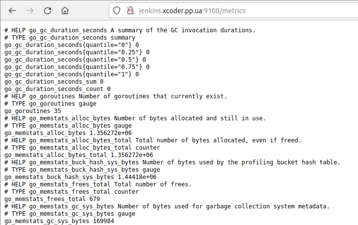
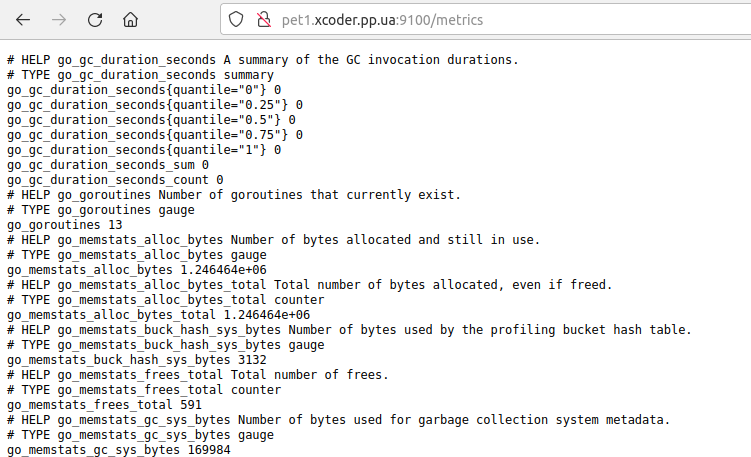
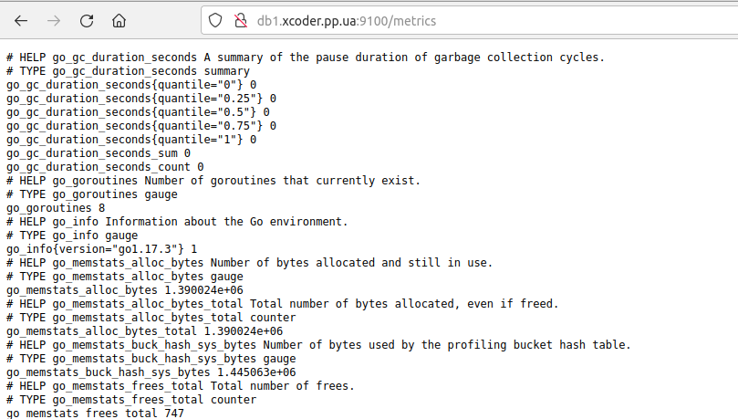
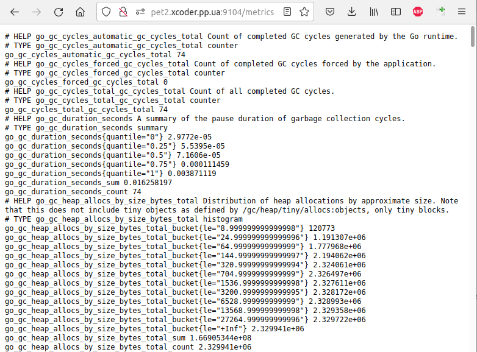

# Prometheus+Grafana Monitoring

## Intro

More info [1](https://habr.com/ru/post/652185/) [2](https://eax.me/prometheus-and-grafana/)

Everyone needs monitoring: both the servers of large technology companies and home Raspberry PIs. Monitoring lets you know when a server is down, when disk space is running out, and even when it's time to upgrade.

**Prometheus** is an open source (Apache 2.0) time series DBMS (Database Management System)  written in Go and originally developed by SoundCloud. In other words, this thing stores your metrics. An interesting feature of Prometheus is that it pulls metrics from a given set of services (does a pull). Due to this, Prometheus cannot get any queues or something like that, which means that monitoring will never become a bottleneck in the system. The project is also interesting in that it fundamentally does not offer any horizontal scaling or high availability.

**Node Exporter** is a service whose task is to export information about a machine in a format understandable by Prometheus. In general, many ready-made exporters have been written for Prometheus for almost all existing systems - all sorts of web servers, DBMS, message queues, and so on. For the purposes of this note, we will only be using the Node Exporter, as you will need it anyway. Setting up other exporters is unlikely to be much different.

**Grafana** is an open source (Apache 2.0) web frontend to various time series database engines such as Graphite, InfluxDB, and of course Prometheus. All in all, Grafana draws beautiful graphs for you using information from Prometheus. Characteristically, Prometheus also has its own web interface. However, it is extremely minimalistic and rather inconvenient. Therefore, even the Prometheus developers themselves recommend using Grafana.

## 1. Node Exporter + MySQL Exporter

Install on needed nodes.

### 1.1. Docker / Jenkins node (Ubuntu 18.04)

```
wget https://github.com/prometheus/node_exporter/releases/download/v1.3.1/node_exporter-1.3.1.linux-amd64.tar.gz
tar xvfz node_exporter-1.3.1.linux-amd64.tar.gz
cd node_exporter-1.3.1.linux-amd64/
sudo useradd -s /sbin/nologin --system -g node_exporter node_exporter
sudo cp node_exporter /usr/local/bin/
sudo chown node_exporter /usr/local/bin/node_exporter
sudo chgrp node_exporter /usr/local/bin/node_exporter
sudo chmod a+x /usr/local/bin/node_exporter
```

Open file

`sudo nano /etc/systemd/system/node_exporter.service`

and add lines

```
[Unit]
Description=Prometheus Node Exporter
Wants=network-online.target
After=network-online.target

[Service]
User=node_exporter
Group=node_exporter
Type=simple
ExecStart=/usr/local/bin/node_exporter

[Install]
WantedBy=multi-user.target
```

Enable and start service

```
sudo systemctl enable node_exporter
sudo systemctl start node_exporter
sudo systemctl status node_exporter
```

Add port 9100 to Jenkins node security group as open from anywhere.

Node Exporter is distributed as a single binary file that can be run from anywhere on the system. So the installation is pretty easy. After launch, go to the browser at the address

`http://jenkins.xcoder.pp.ua:9100/metrics`

and look at the collected metrics in the web browser



### 1.2. App Tomcat node (Ubuntu 18.04)

[Install info](https://github.com/redhat-cop/tower_grafana_dashboards/blob/master/install_node_exporter.yaml)

Add to [App Ansible playbook 1](https://github.com/uixcoder/Deploy_AWS_EC2_PostgerSQL/blob/master/Ansible/configAppServer.yml), [App Ansible playbook 1](https://github.com/uixcoder/Deploy_AWS_EC2_RDS_MySQL/blob/master/Ansible/configAppServer.yml) lines

```
    # Install node exporter
    - name: Add user node_exporter
      user:
        name: node_exporter
        shell: /bin/false
        system: true
        create_home: no

    - name: Download and extract 
      unarchive:
        src: https://github.com/prometheus/node_exporter/releases/download/v1.3.1/node_exporter-1.3.1.linux-amd64.tar.gz
        dest: /tmp
        remote_src: yes

    - name: Copy bin node_exporter to /usr/local/bin
      copy:
        #force: yes
        remote_src: yes
        src: /tmp/node_exporter-1.3.1.linux-amd64/node_exporter
        dest: /usr/local/bin/
        owner: node_exporter
        group: node_exporter
        mode: u+x,g+x,o+x   

    - name: Create service node_exporter.service
      blockinfile:
        path: /etc/systemd/system/node_exporter.service
        block: |
          [Unit]
          Description=Prometheus Node Exporter
          Wants=network-online.target
          After=network-online.target
          [Service]
          User=node_exporter
          Group=node_exporter
          Type=simple
          ExecStart=/usr/local/bin/node_exporter
          [Install]
          WantedBy=multi-user.target
        create: true

    - name: systemctl daemon_reload
      systemd:
        daemon_reload: yes

    - name: Start and Enable node_exporter
      service:
        name: node_exporter
        state: started
        enabled: yes

    - name: Check whether port 9100 is available
      wait_for:
        port: 9100
        state: started
        timeout: 5
```

Test Node Exporter

`http://pet1.xcoder.pp.ua:9100/metrics`



### 1.3. Db PostgreSQL node (RHEL 8)

Add to [Db Ansible playbook](https://github.com/uixcoder/Deploy_AWS_EC2_PostgerSQL/blob/master/Ansible/configDbServer.yml) the same lines as for Ubuntu 18.04.

Test Node Exporter

`http://db1.xcoder.pp.ua:9100/metrics`



### 1.4. MySQL Exporter (AWS RDS Mysql Database)

Installed on Tomcat node (pet2.xcoder.pp.ua) connect to AWS RDS MySQL Database Instance.

Instructions [1]() and [2]() was used while writing [ansible playbook](https://github.com/uixcoder/Deploy_AWS_EC2_RDS_MySQL/blob/master/Ansible/configAppServer.yml) for installing and configuring MySQL Exporter

```
    # Install mysql node exporter
    - name: Add user node_exporter
      user:
        name: mysql_exporter
        shell: /bin/false
        system: true
        create_home: no

    - name: Download and extract 
      unarchive:
        src: https://github.com/prometheus/mysqld_exporter/releases/download/v0.14.0/mysqld_exporter-0.14.0.linux-amd64.tar.gz
        dest: /tmp
        remote_src: yes

    - name: Copy bin mysqld_exporter to /usr/local/bin
      copy:
        remote_src: yes
        src: /tmp/mysqld_exporter-0.14.0.linux-amd64/mysqld_exporter
        dest: /usr/local/bin/
        owner: mysql_exporter
        group: mysql_exporter
        mode: u+x,g+x,o+x   

    - name: Create config database credentials
      blockinfile:
        path: /etc/.mysqld_exporter.cnf
        block: |
          [client]
          user={{ db_user}}
          password={{ db_password }}
          host=db2.xcoder.pp.ua
        create: true   

    - name: Set ownership permissions
      shell: chown root:mysql_exporter /etc/.mysqld_exporter.cnf
      args:
        warn: false

    - name: Create service mysql_exporter.service
      blockinfile:
        path: /etc/systemd/system/mysql_exporter.service
        block: |
          [Unit]
          Description=Prometheus MySQL Exporter
          After=network.target
          User=mysql_exporter
          Group=mysql_exporter

          [Service]
          Type=simple
          Restart=always
          ExecStart=/usr/local/bin/mysqld_exporter \
          --config.my-cnf /etc/.mysqld_exporter.cnf \
          --collect.global_status \
          --collect.info_schema.innodb_metrics \
          --collect.auto_increment.columns \
          --collect.info_schema.processlist \
          --collect.binlog_size \
          --collect.info_schema.tablestats \
          --collect.global_variables \
          --collect.info_schema.query_response_time \
          --collect.info_schema.userstats \
          --collect.info_schema.tables \
          --collect.perf_schema.tablelocks \
          --collect.perf_schema.file_events \
          --collect.perf_schema.eventswaits \
          --collect.perf_schema.indexiowaits \
          --collect.perf_schema.tableiowaits \
          --collect.slave_status \
          --web.listen-address=0.0.0.0:9104

          [Install]
          WantedBy=multi-user.target
        create: true

    - name: systemctl daemon_reload
      systemd:
        daemon_reload: yes

    - name: Start and Enable mysql_exporter
      service:
        name: mysql_exporter
        state: started
        enabled: yes

    - name: Check whether port 9104 is available
      wait_for:
        port: 9104
        state: started
        timeout: 5    
```

Test MySQL Exporter

`http://pet2.xcoder.pp.ua:9104/metrics`

