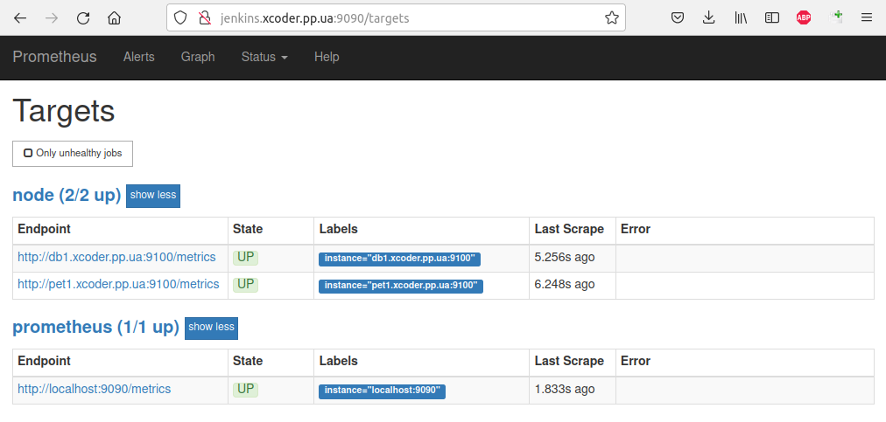
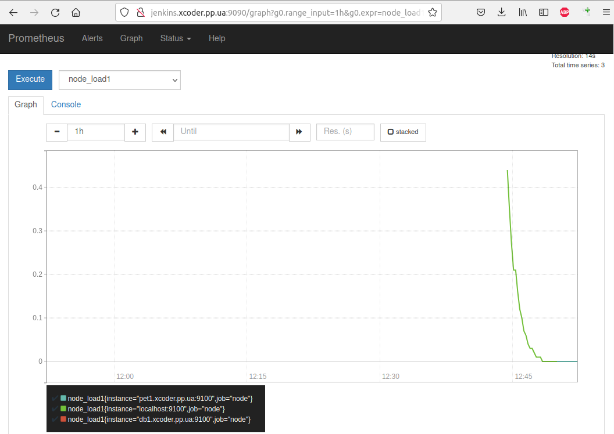

## 2. Prometheus

[Official repository](https://github.com/prometheus/prometheus)
[Install info](https://computingforgeeks.com/install-prometheus-server-on-debian-ubuntu-linux/)

The second step is to install Prometheus and configure it to collect data from the previously installed Node Exporter.

### Step 1: Create Prometheus system group

Let’s start by creating the Prometheus system user and group.

`sudo groupadd --system prometheus`

The group with ID < 1000 is a system group. Once the system group is added, create Prometheus system user and assign primary group created.

`sudo useradd -s /sbin/nologin --system -g prometheus prometheus`

### Step 2: Create data & configs directories for Prometheus

Prometheus needs a directory to store its data. We will create this under /var/lib/prometheus.

`sudo mkdir /var/lib/prometheus`

Prometheus primary configuration files directory is /etc/prometheus/. It will have some sub-directories:

`for i in rules rules.d files_sd; do sudo mkdir -p /etc/prometheus/${i}; done`

### Step 3: Download Prometheus on Ubuntu 22.04/20.04/18.04

We need to download the latest release of Prometheus archive and extract it to get binary files. You can check releases from Prometheus releases Github page.

`sudo apt update`

If not installed

`sudo apt -y install curl nano`

Then download latest binary archive for Prometheus.

```
mkdir -p /tmp/prometheus && cd /tmp/prometheus
curl -s https://api.github.com/repos/prometheus/prometheus/releases/latest | grep browser_download_url | grep linux-amd64 | cut -d '"' -f 4 | wget -qi -
```

Extract the file:

```
tar xvf prometheus*.tar.gz
cd prometheus*/
```

Move the binary files to /usr/local/bin/ directory.

`sudo mv prometheus promtool /usr/local/bin/``

Check installed version:

```
$ prometheus --version
$ promtool --version
```

Move Prometheus configuration template to /etc directory.

`sudo mv prometheus.yml /etc/prometheus/prometheus.yml`

Also move consoles and console_libraries to /etc/prometheus directory:

`sudo mv consoles/ console_libraries/ /etc/prometheus/
cd $HOME`

### Step 4: Configure Prometheus on Ubuntu 22.04/20.04/18.04

#### Create or edit a configuration file for Prometheus – /etc/prometheus/prometheus.yml.

`sudo nano /etc/prometheus/prometheus.yml`

The template configurations should look similar to below:

```
# my global config
global:
  scrape_interval: 15s # Set the scrape interval to every 15 seconds. Default is every 1 minute.
  evaluation_interval: 15s # Evaluate rules every 15 seconds. The default is every 1 minute.
  # scrape_timeout is set to the global default (10s).

# Alertmanager configuration
alerting:
  alertmanagers:
    - static_configs:
        - targets:
          # - alertmanager:9093

# Load rules once and periodically evaluate them according to the global 'evaluation_interval'.
rule_files:
  # - "first_rules.yml"
  # - "second_rules.yml"

# A scrape configuration containing exactly one endpoint to scrape:
# Here it's Prometheus itself.
scrape_configs:
  # The job name is added as a label `job=<job_name>` to any timeseries scraped from this config.
  - job_name: "prometheus"

    # metrics_path defaults to '/metrics'
    # scheme defaults to 'http'.

    static_configs:
     - targets: ['jenkins.xcoder.pp.ua:9100', 'pet1.xcoder.pp.ua:9100', 'db1.xcoder.pp.ua:9100', 'pet2.xcoder.pp.ua:9100']


  - job_name: mysql
    static_configs:
    - targets: ['db2.xcoder.pp.ua:9104']
```

Here we have configured Prometheus to collect metrics from prometheus services of the Node Exporter instances ('pet1.xcoder.pp.ua:9100', 'db1.xcoder.pp.ua:9100', 'db1.xcoder.pp.ua:9100') and MySQL Exporter ('db2.xcoder.pp.ua:9104').

You can edit the file to your default liking and save it.

#### Create a Prometheus systemd Service unit file

To be able to manage Prometheus service with systemd, you need to explicitly define this unit file.

`sudo nano /etc/systemd/system/prometheus.service`

```
[Unit]
Description=Prometheus
Documentation=https://prometheus.io/docs/introduction/overview/
Wants=network-online.target
After=network-online.target

[Service]
Type=simple
User=prometheus
Group=prometheus
ExecReload=/bin/kill -HUP $MAINPID
ExecStart=/usr/local/bin/prometheus --config.file=/etc/prometheus/prometheus.yml --storage.tsdb.path=/var/lib/prometheus --web.console.templates=/etc/prometheus/consoles --web.console.libraries=/etc/prometheus/console_libraries --web.listen-address=0.0.0.0:9090
SyslogIdentifier=prometheus
Restart=always


[Install]
WantedBy=multi-user.target
```

Change directory permissions.

Change the ownership of these directories to Prometheus user and group.

```
for i in rules rules.d files_sd; do sudo chown -R prometheus:prometheus /etc/prometheus/${i}; done
for i in rules rules.d files_sd; do sudo chmod -R 775 /etc/prometheus/${i}; done
sudo chown -R prometheus:prometheus /var/lib/prometheus/
```

Reload systemd daemon and start the service:

```
sudo systemctl daemon-reload
sudo systemctl start prometheus
sudo systemctl enable prometheus
```

Check status using systemctl status prometheus command:

```
$ systemctl status prometheus
```

#### Test Prometheus installation

Open port 9090 on Docker/Jenkins node.

After launching Prometheus, you can open its user interface in the browser 'http://jenkins.xcoder.pp.ua:9090'. The "/targets" page displays the status of the systems you are getting metrics from. If everything is good, then in the Status column (State) will be “UP”.



Already using only Prometheus, you can query the collected data and build graphs using the tools on the "/graph" page. It's a good tool for learning the metrics you're collecting and writing complex data queries. But we will entrust this work to Grafana.

