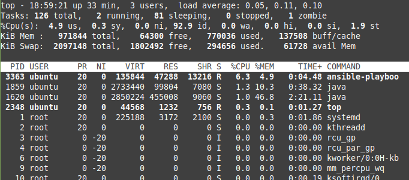
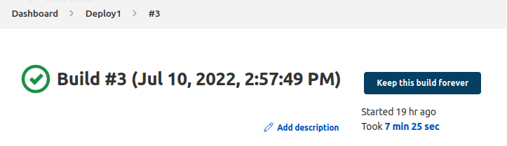
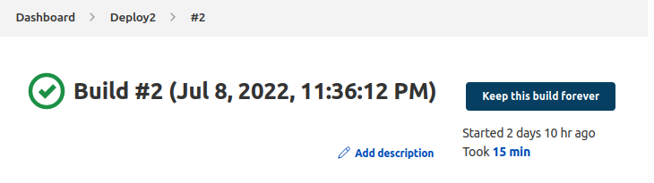
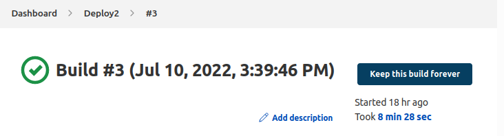
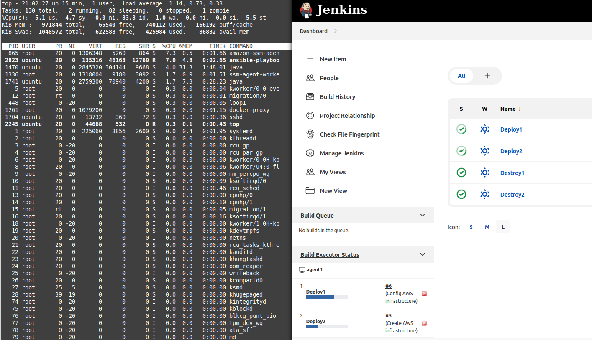
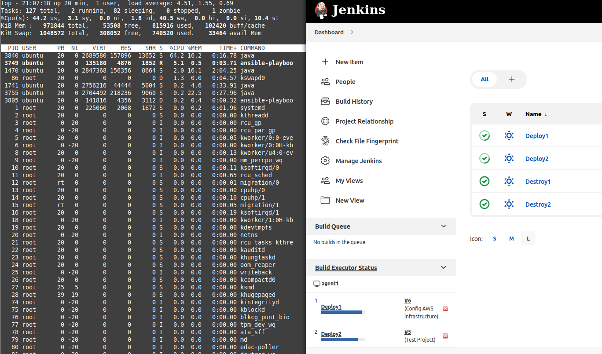
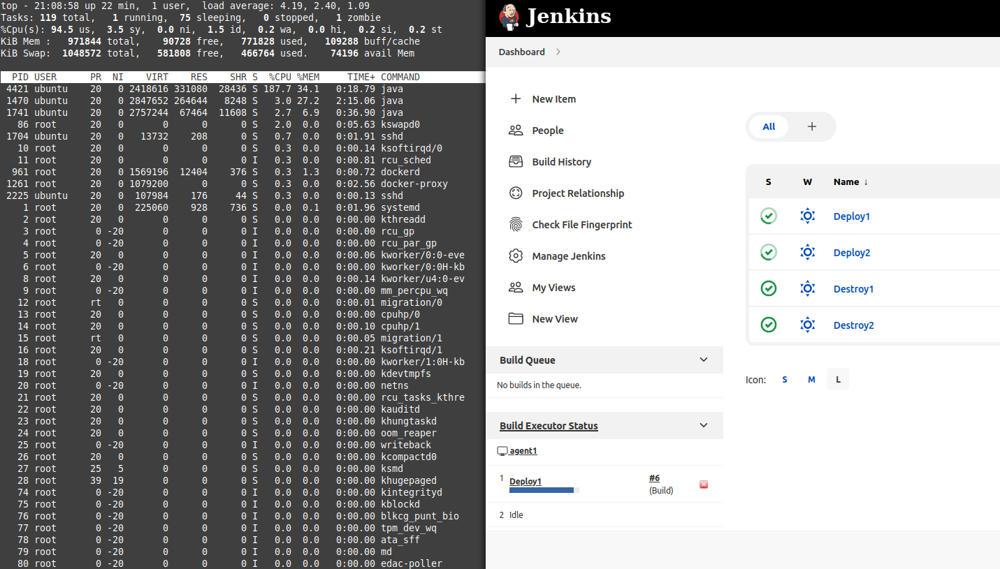
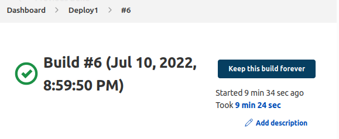
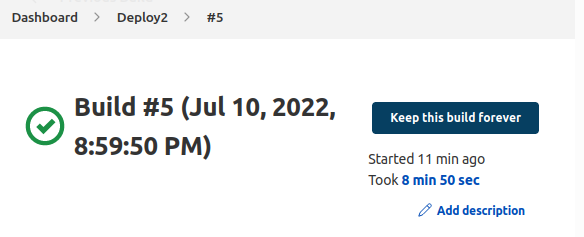

# Testing under load

## Test Docker/Jenkins configuration under load 

### 1 executor on agent1 + 2GB swap area

Pipelines uses not so much memory --> swap area decreased to 1GB.

Time for deployment 1

Time for deployment 2

is very dependant on time for creating database in AWS RDS. Sometimes it's too long.

### 2 executors on agent1 + 1GB swap area

Memory consumption is not so big

but when using **maven** for testing or building .war it increases

The total run time of 2 pipelines is not much bigger than 1 alone.

**SUMMARY:** Selected AWS configuration is enough for test deployment and is even good as for free tier aws services.