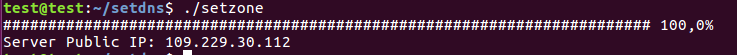
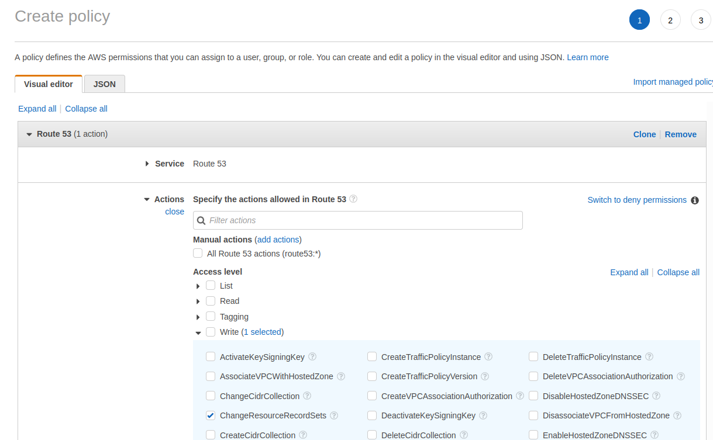
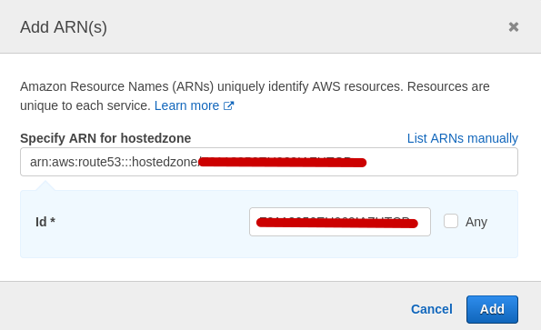
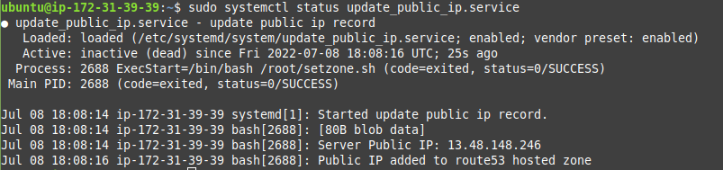

## Update DNS (Route 53) record for EC2 Instance (Jenkins) on VM Startup

When EC2 Instance starts it has new public IP address.

To get permanent access to Jenkins we need to add record to Route53 hosted zone and update it every time EC2 Instance starts.

I created small [bash script](setzone.sh) that automates this process
```
#!/bin/bash

publicIp=$(curl -# checkip.amazonaws.com)

echo 'Server Public IP: '$publicIp

export AWS_ACCESS_KEY_ID=....................
export AWS_SECRET_ACCESS_KEY=...........................................

cat <<EOT > zone.json
{
    "Comment": "Update record to reflect new IP address of home router",
    "Changes": [
        {
            "Action": "UPSERT",
            "ResourceRecordSet": {
                "Name": "jenkins.xcoder.pp.ua.",
                "Type": "A",
                "TTL": 300,
                "ResourceRecords": [
                    {
                        "Value": "$publicIp"
                    }
                ]
            }
        }
    ]
}
EOT

aws route53 change-resource-record-sets --hosted-zone-id Z0118956EU069IAZHTCP --change-batch file://zone.json > /dev/null

rm zone.json

unset AWS_ACCESS_KEY_ID
unset AWS_SECRET_ACCESS_KEY

echo 'Public IP added to route53 hosted zone '
```
Result of work:



For correct access I created custom user **edit_zone_xcoder** with only needed rights for editing my zone 





and generated for him AWS_ACCESS_KEY_ID/AWS_SECRET_ACCESS_KEY

[Install aws cli on Jenkins server](https://docs.aws.amazon.com/cli/latest/userguide/getting-started-install.html)

```
curl "https://awscli.amazonaws.com/awscli-exe-linux-x86_64.zip" -o "awscliv2.zip"
unzip awscliv2.zip
sudo ./aws/install
```

Then i added setzone.sh script to auto start

Also i created file /etc/systemd/system/update_public_ip.service:

`$ sudo nano /etc/systemd/system/update_public_ip.service`

```
[Unit]
Description=update public ip record

[Service]
ExecStart=/bin/bash /root/setzone.sh

[Install]
WantedBy=multi-user.target
```

and configured autostart of created service

`$ sudo systemctl daemon-reload`

`$ sudo systemctl enable update_public_ip.service`


`$ sudo systemctl start update_public_ip.service`

`$ sudo systemctl status update_public_ip.service`




