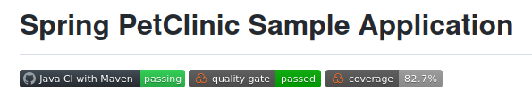

# PetClinic Project AWS Deployments

The project [**spring-framework-petclinic**](https://github.com/spring-petclinic/spring-framework-petclinic) was selected as a sample project for AWS Deployment.

[My forked version of project](https://github.com/uixcoder/spring-framework-petclinic) has some small changes (related to the default database selection) in **pom.xml** file as i done 2 variants of the deployment.

## Main Stages on working with Deployments:

### 1. Manual deployment of PetClinic Project on Virtualbox VM (Ubuntu 18.04)
    
1. Gathering info about needed software.  
Petclinic Project works well on the such versions of software packages:
    - Git 3.8.6
    - Open JDK 11
    - Maven 3.8.6
    - Tomcat 9.0.64
         

2. Manual testing of the App run with Built-in Database ([Test run app](img/0_1.png))  
**Problem:** Error on Bootstrap / jQuery versions  
**Solution:** change Bootstrap version 3.3.6 to 3.4.1 in all project files

3. Manual testing of the App run with MySQL Database (local Docker)  
Works normally...

4. Manual testing of the App run with PostgreSQL Database (local Docker)  
**Problem:** 8 Built-in Tests Fail on different PostgreSQL versions, but application works.  
**Solution:** Disable testing up to the app code fixing (app used too old variant of PostgreSQL for testing). **Testing for PostgreSQL is disabled in deployment.**

### 2. Deployment variants

   1. **Tomcat + PostgreSQL**

      - ***Application AWS EC2 Instance***  
          - 2vCPU, 1GiB RAM, 8 GiB HDD/SDD (t3.micro, eu-north-1, Stockholm)  
          - Ubuntu 18.04 + Open JDK 11 + Tomcat 9.0.64  

      - ***Database AWS EC2 Instance***  
          - 2vCPU, 1GiB RAM, 8 GiB HDD/SDD (t3.micro, eu-north-1, Stockholm)  
          - RHEL 8 + PostgreSQL 10.21 

   2. **Tomcat + MySQL**

      - ***Application AWS EC2 Instance***  
          - 2vCPU, 1GiB RAM, 8 GiB HDD/SDD (t3.micro, eu-north-1, Stockholm)  
          - Ubuntu 18.04 + Open JDK 11 + Tomcat 9.0.64  

      - ***AWS RDS MySQL Database***  
          - t3.micro, 10 GiB Storage
          - MySQL 8.0.28

### 3. Create local VirtualBox VM for Docker + Jenkins / Jenkins agents containers

   1. VM: 2CPU, 4GiB RAM, 20GiB HDD(SDD) + Ubuntu 18.04 Server.

   2. Install / configure Docker Engine.
   
   3. Create Jenkins Docker container with DockerHub image `jenkins/jenkins:lts-jdk11`.
   
   4. Create Jenkins agent Docker Container with `'docker build'` for `Dockerfile` based on DockerHub image `jenkins/ssh-agent:jdk11` + Terraform and Ansible  
   
   5. Add JGit and Maven auto istallation  

### 4. Terraform scripts for creating infrastructure (Infrastructure-as-Code, Iac)

   1. [Tomcat + PostrgreSQL](https://github.com/uixcoder/Deploy_AWS_EC2_PostgerSQL/tree/master/Terraform)
   2. [Tomcat + MySQL](https://github.com/uixcoder/Deploy_AWS_EC2_RDS_MySQL/tree/master/Terraform)

### 5. Ansible playbooks for configuring infrastructure

   1. [Tomcat + PostrgreSQL](https://github.com/uixcoder/Deploy_AWS_EC2_PostgerSQL/tree/master/Ansible)
   2. [Tomcat + MySQL](https://github.com/uixcoder/Deploy_AWS_EC2_RDS_MySQL/tree/master/Ansible)

### 6. Configure Jenkins EC2 Instance (Jenkins and agents as Docker container) with public DNS name

   1. AWS EC2 Instance: 2vCPU, 1GiB RAM, 8-12 Gb HDD/SDD (t3.micro, eu-north-1, Stockholm) 
   2. [Configuration details](JenkinsConfig.md)
   3. [Update DNS (Route 53) record for EC2 Instance (Jenkins) on VM Startup](UpdateZoneForEC2.md)

### 7. Create Jenkins pipelines for deployments

   1. Tomcat + PostrgreSQL [pipeline codes](https://github.com/uixcoder/Deploy_AWS_EC2_PostgerSQL/tree/master/Jenkins) 
      - [Create and manage infrastructure](Deploy1Application.md)
      - [Destroy infrastructure](Destroy1Deployment.md)

   2. Tomcat + MySQL [pipeline codes](https://github.com/uixcoder/Deploy_AWS_EC2_RDS_MySQL/tree/master/Jenkins)
      - [Create and manage infrastructure](Deploy2Application.md)
      - [Destroy infrastructure](Destroy2Deployment.md)

### 8. Testing and fixing bugs

   1. Fixing bugs 

   2. [Testing under load](Testing.md)

### 9. Add status monitoring for AWS EC2 Instances / RDS MySQL nodes using Prometheus / Grafana 
 
   1. [Prometheus Node Exporter + MySQL Exporter](PG_NodeExporter_MySqlExporter.md) 

   2. [Prometheus](PG_Prometheus.md)

   3. [Grafana](PG_Grafana.md)

### 10. Writing runbooks

