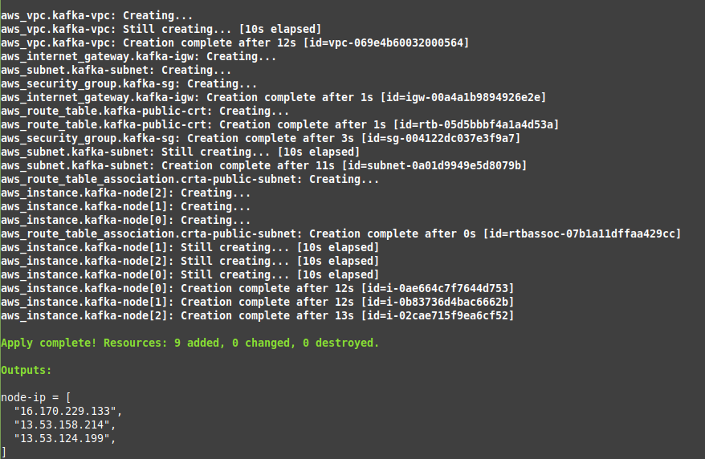
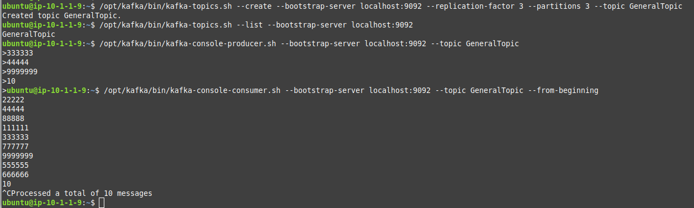

## Task

### Infrastructure -- [Terraform files](Terraform)

VPC + Subnet

Terraform test run for 3 nodes on AWS t3.micro (free tier).

Number of nodes may be changed in [vars.tf](Terraform/vars.tf) file

Terraform outputs with ip-addresses moves to file [Ansible/hosts](Ansible/hosts) to provide correct Ansible run for created AWS nodes with ansible names 0 - N.

### Configuration -- [Ansible files](Ansible)

**Configuration for all nodes:**

1. Add 1G swap space to AWS Nodes
2. Install Java
3. Create kafka group/user
4. Create Zookeper data directory "/zookeeper"
5. Create Kafka log directory "/kafka"
6. Add zookeeper myid file to "/zookeeper" directory
7. Update kafka broker.id line / Update kafka zookeeper.connect line
8. Create a Service file for ZooKeeper / Kafka
9. Start ZooKeeper / Kafka services.
10. Validating ZooKeeper / Kafka.

.......

### Test Install

All brokers in one cluster:

Create topic + read/write:

