### Write a utility for generating passwords according to a given template that supports the CLI interface and logging (-vvv – show detailed information during processing)

[Utility main code](pass.py)

[Module passwords code](passwords.py)

### Results

#### Utility run with -t TEMPLATE
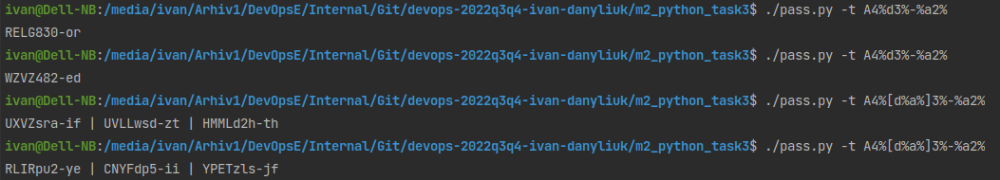
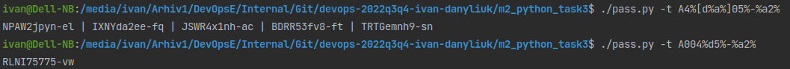

#### Utility run with -t TEMPLATE with errors in template
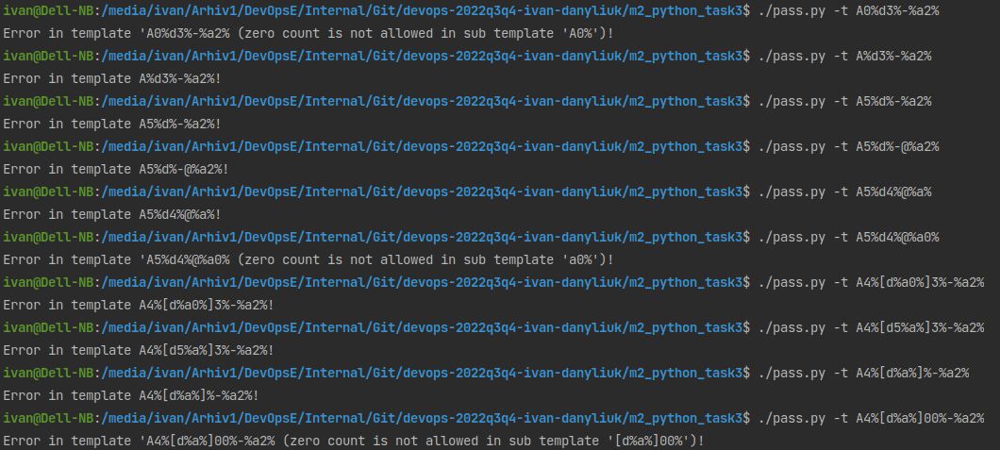

#### Utility run with other errors
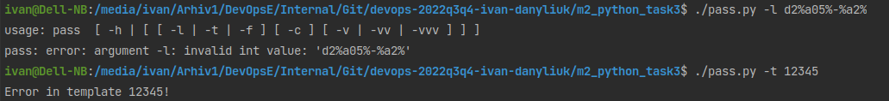

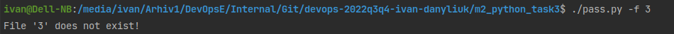

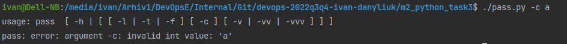


#### Utility run with -l LENGTH, with -c COUNT for -l and -t parameters
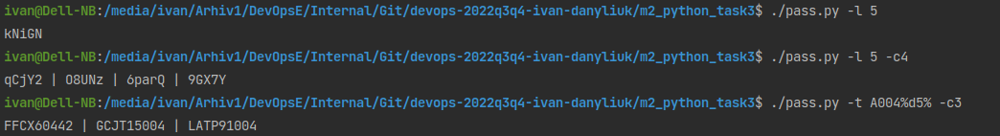

#### Utility run with -f FILE and -f FILE -c COUNT
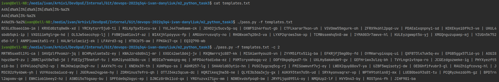

#### Utility run with -v | -vv | -vvv

```
  -v           verbose / warning+ level
  -vv          verbose / info+ level
  -vvv         verbose / debug+ level
```
parameters

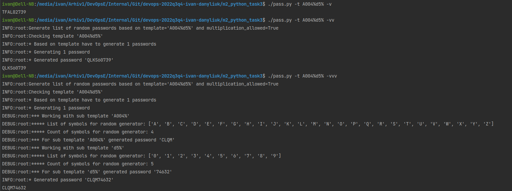

#### Utility run with -c COUNT without any other parameters
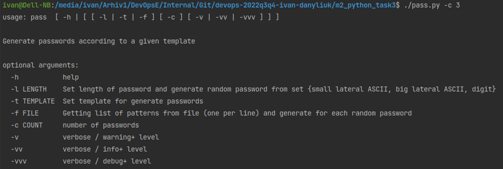


#### Utility run without parameters
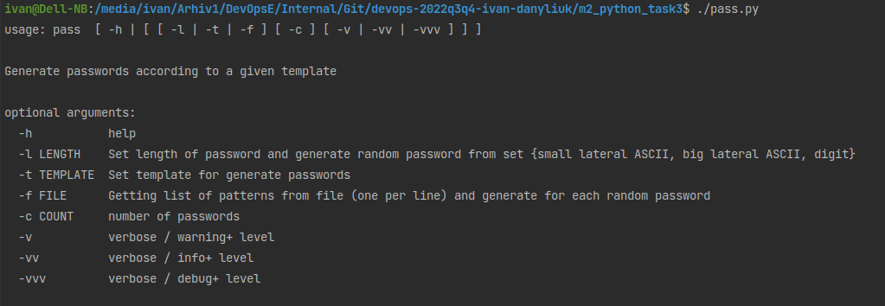

#### Utility help 
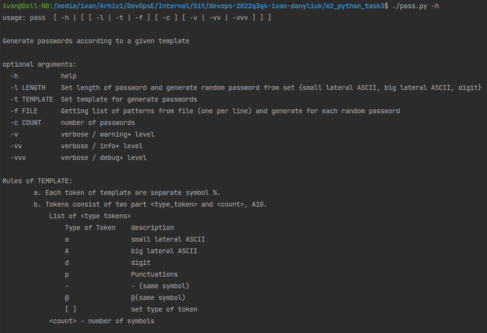