## Работа с классом xSV files (CSV, TSV, DSV):

a) Работа с каноническим форматом файлов CSV, TSV, DSV).

– Реализовать import/export данных из данных форматов:

a. содержит/не содержит заголовок;

b. фильтрование:

    a. по списку;
    b. по контенту (шаблон regex) в определенном поле;
    c. по контенту (шаблон regex) в нескольких полях;

c. работа с фрагментом файла:
    
    a. по строкам:
        – один диапазон;
        – несколько диапазонов * ;
    b. по столбцам;

d. данные полей:
    
    a. single string
    b. multi-string*;

e. обработка файла при нарушении канонического формата (попытаться максимально полно
получить контент) † ;

c) Реализовать пункт а)

    – by pure python string, module re (regular expression);
    – by using python module CSV.

d) Convert CSV to JSON with Python

    – by pure python module CSV and JSON;

## Results:

[csv_utility](csv_utility.py) with [CsvFileParser](CsvFileParser.py) Class

### Utility help 

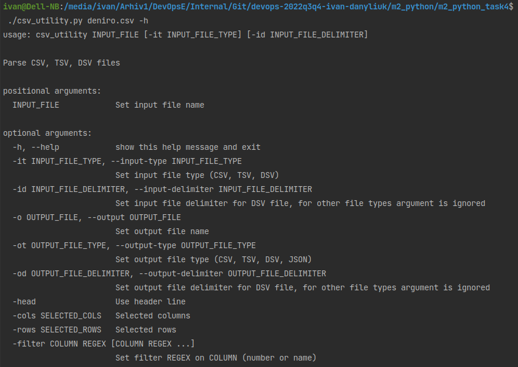

### Support input file formats

    CSV
    TSV
    DSV (with defined delimiter)

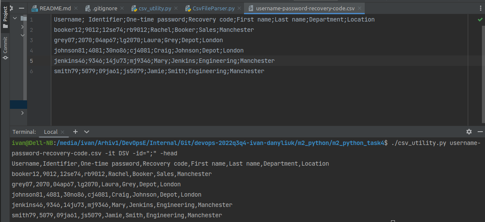

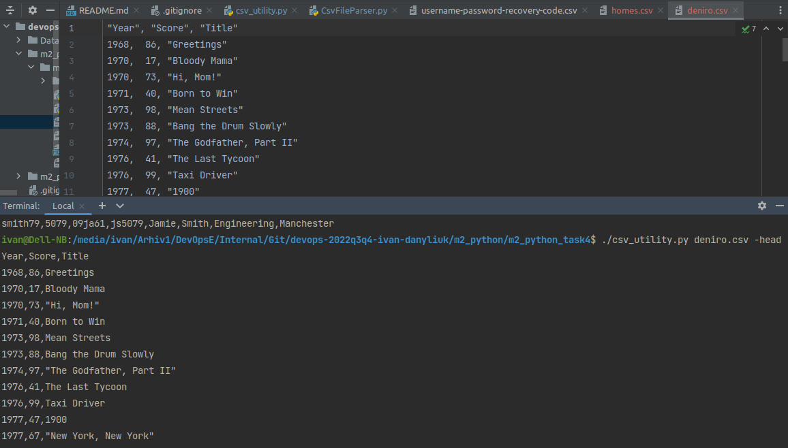

### Support output formats to screen/file 

    CSV
    TSV
    DSV (with defined delimiter)
    JSON

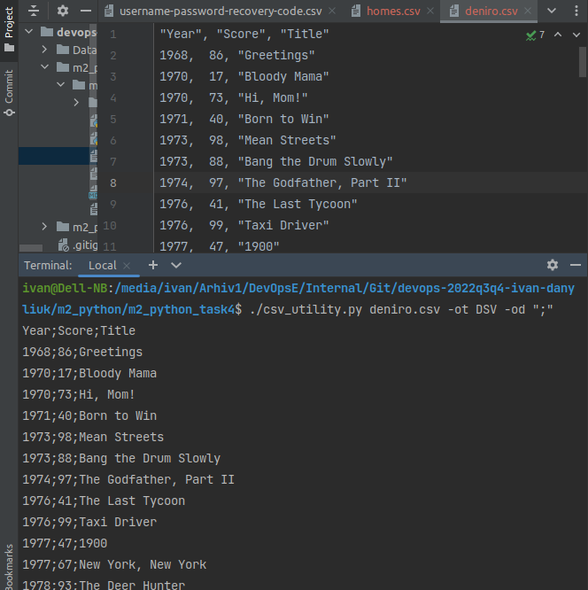

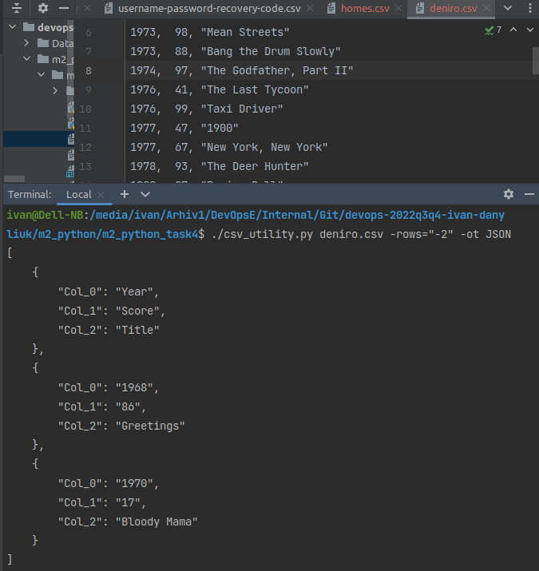

### JSON without header / with header

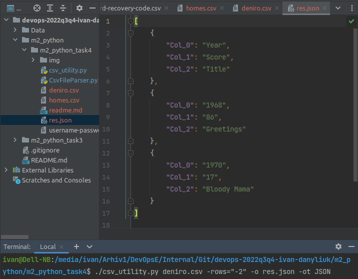

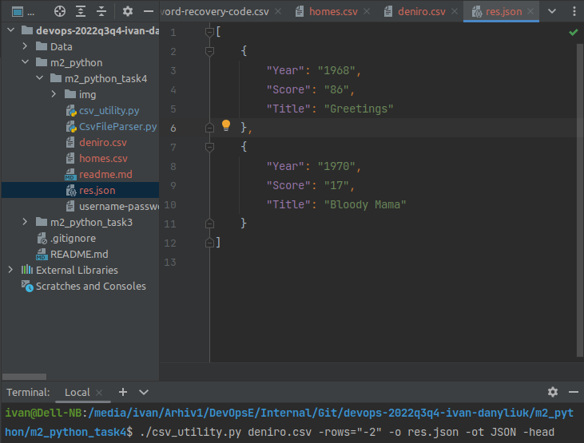

### Columns select

```
-cols SELECTED_COLS

SELECTED_COLS:

    N         - select column N (0 - [ColCount-1])
    Start-End - select columns from Start to End
    -End      - select columns from beginning of line to End
    Start-    - select columns from Start to end of line

Examples:
    "-5,6,8-10,50-"
    "1,15,17-22,40-"
    "50-"
    "-40"
```
### Rows select

```
-rows SELECTED_ROWS

SELECTED_ROWS:

    N         - select row N (0 - [RowCount-1])
    Start-End - select rows from Start to End
    -End      - select rows from beginning of file to End
    Start-    - select rows from Start to end of file

Examples:
    "-5,6,8-10,50-"
    "1,15,17-22,40-"
    "50-"
    "-40"
```
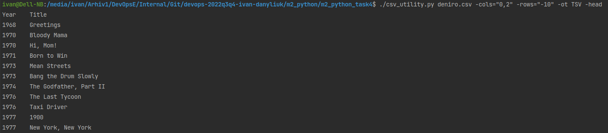

### Filter on columns

```
-filter COLUMN REGEX [COLUMN REGEX ...]

Set filter REGEX on COLUMN (number or name)

Examples:

- filter 0 "\d+" Name "Oscar"
```

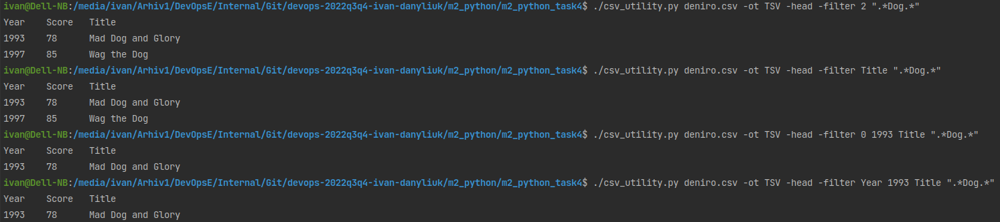

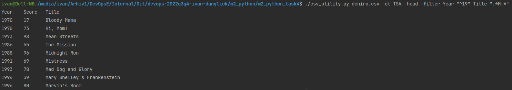

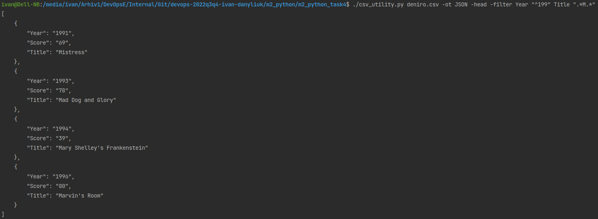